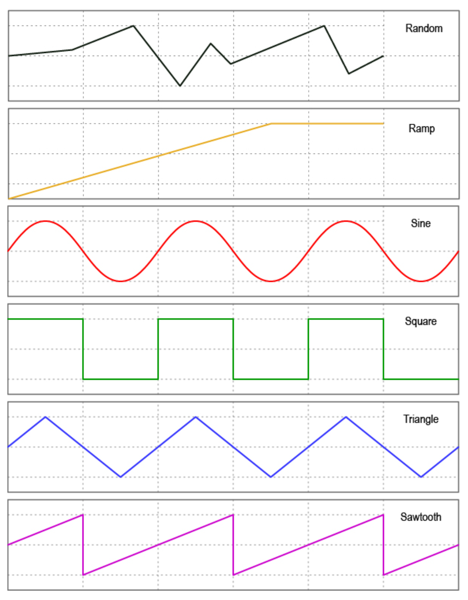

## 9. LFOs

### Setting LFOs
The Aero has three LFOs per bank that can run simultaneously and independently with deep customisation and flexibility.

LFOs are assigned to a particular message stack on a particular switch. When active, the LED becomes an indicator of the LFO, showing both frequency and wave shape with the pulsing/ fading of the LED itself.

To start setting LFO parameters, go to LFO Settings under the switch configuration page on the web editor.

The following headings address each of the LFO settings available.

#### 1. LFO State
Toggle this setting between `on` or `off` to activate or deactivate the LFO.

#### 2. Sync Mode
For each LFO you choose to activate, you can set a `free` frequency (default) or choose to sync to MIDI `clock`.

#### 3. LFO Frequency
his sets the frequency of the oscillation from the minimum value to the maximum value. In free sync mode, this is set in Hertz (times per second). The Hz range is from `0.1Hz` to `10Hz`.

When synced to MIDI clock, the frequency is set as a time division of the tempo.

**Available Time Divisions:**
• 1/4
• 1/4 Triplet
• 1/4 Dotted
• 1/8
• 1/8 Triplet
• 1/8 Dotted
• 1/16
• 1/16 Triplet
• 1/16 Dotted

#### 4. LFO Trigger
There are two options for triggering the LFO. `Toggle` or `Hold`.

`Toggle` will start the LFO after pressing the footswitch, and it will continue to run until you press the footswitch again to turn it off. This is useful for auto-panning, auto-wah, oscillating frequencies with an EQ or other constant modulation.

`Hold` will run the LFO only while you hold down the footswitch. This is useful for one-off intentional parameter changes, or for on-the-fly virtual knob twisting (press and hold to slowly turn up the MIDI-controllable gain knob on your drive pedal) or for ramping effects like opening a cutoff filter.

#### 5. LFO Limits
The Min Limit and Max Limit parameters set the range that the LFO will oscillate between. If you want to limit the range of oscillation to be smaller than the full 0-127 values of a normal MIDI message, use these limits.

!!! example
    I may use an LFO to auto-wah with an EQ, but I don’t want to cover the whole sound spectrum - I just want to oscillate in the mids to high mids. So I set the Min Limit to 60 and the Max Limit to 100. 
    This contains the parameter I’m modulating to just the upper mid section.

#### 6. LFO Shape (Waveform)
You can choose from 6 different waveform shapes to moldulate your MIDI data: 

• Sine
• Triangle
• Saw
• Ramp
• Square
• Random 

!!! tip "`Random` Wave Shape Tip" 
    Set the step size. If a random value is within the step size, it will regenerate to create a new value outside the step size of the previous value generated. 

#### 7. LFO Messages
This setting allows you to choose the message stack that the LFO will modulate. Any compatible message in this stack will be what the LFO uses to create the oscillating MIDI data.

For instance, if you choose the toggle on stack, then any messages in the toggle on stack are what the LFO will oscillate. If there are 12 MIDI CC messages in that stack, all 12 will be oscillated with the settings chosen.

#### 8. LFO Modulation Source
Not currently active. Please wait for a future update.

#### 9. LFO MOdulation Target
Not currently active. Please wait for a future update.

#### 10. LFO Reset
Choosing `Yes` will reset the waveform each time you start or restart the LFO. Choosing `No` will keep continuous data between stops.

!!! tip 
    Turning reset to `No` is helpful for continually ramping parameters when using the ramp shape rather than going back to the `min` value each time you activate the LFO, you can increase it gradually in multiple stages by starting and stopping the LFO a few times.

#### 11. LFO Step
The ‘Step’ refers to how smoothly the LFO changes the data of the MIDI messages. A step of `1` means that the data will only change by +/- 1 each time. You can set the step value to `1`, `2`, `4`, `8`, `16`, or `32`.
Setting to one of the higher number may create a “stair-cased” effect because of the abrupt changes in
parameter values. 

!!! tip 
    If you are having stuttering or slow-downs due to the amount of MIDI data being produced by the LFOs, try increasing the step size a little to reduce the amount of datathat needs to be sent in one second.

## 10. Aux Switch In

### Setting Up Auxilliary Switches

#### 1. Activating Aux Switch In Mode
To enable auxiliary switch functions, please set your chosen Flexiport to `Switch In` mode using the web editor.

#### 2. Setting Auxillliary Switch Messages
Single, double or triple auxiliary switches will work in Aux Switch In mode. Aux switches should be momentary switches, and use a TRS cable.

Plug your aux switch into your chosen Flexiport and then assign the functions or MIDI commands by going to `Bank Settings` > `Aux Messages` for bank-level aux switch messages, and going to the `Global Settings` > `Aux Messages` menu for global-level messages.

Both menus allow you to set a single message for each of the press types in the list. Currently the options are `Press`, `Hold`, `Toggle On`, and `Toggle Off`.
This gives you four messages per switch, per aux switch. Then, another four messages per switch at the global level.

Press messages are sent as soon as the switch is pressed. Hold messages are sent after holding down the switch for the set hold time. Hold time can be changed along with the Aux Switch Sensitivity level in the Flexiport Settings menu in the web editor.

`Aux Switch Sensitivity` is a setting designed to accommodate different brands of switches that might physically differ in the way their switches behave. The sensitivity is something you can change if you are noticing erratic behaviour of your Aux Switch.

!!! note 
    If you have problems with a particular aux switch, you can message us or email us to get advice. It is possible that some devices will not be wired in a way that works properly with the Aero.

The messages you can set include Smart Messages and Key Press messages, so you can affect complex features like sequential messages, selecting expression messages, triggering other footswitch groups, sending keyboard macros and much more.