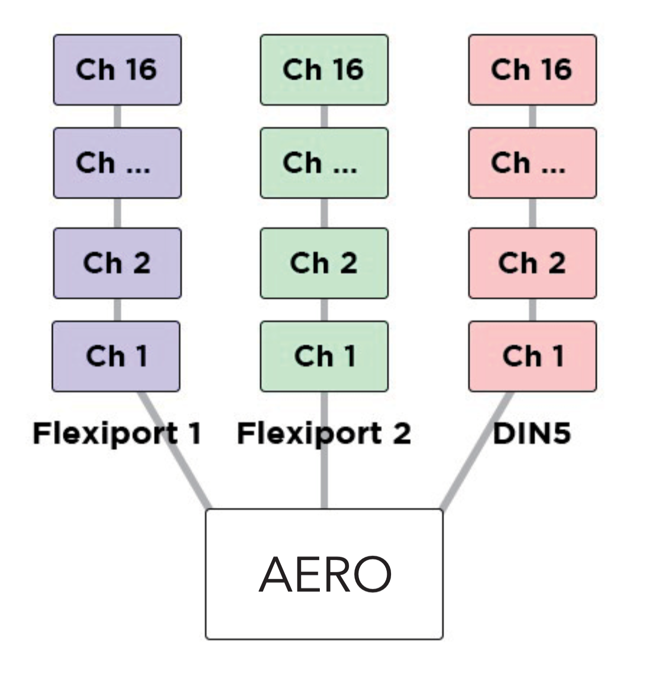
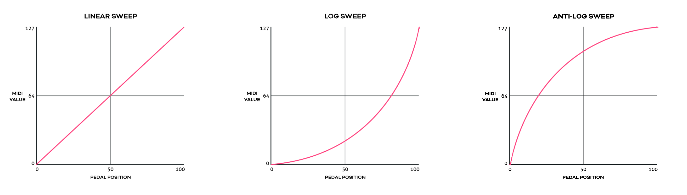

## 7. Messages & Modes

You can program all the functions of your Aero with the onboard menus or the web editor. We’ve made both methods as straightforward as possible so you can quickly get up and running. Here’s an overview of what you can do when programming your Aero. Step-by-step instructions for these methods will be covered in later sections.

### MIDI Messages

Note On, Note Off, Poly Pressure (Aftertouch), Control Change (CC), Program Change (PC), Channel Pressure, and Pitch Bend messages can be set as the message type for any MIDI message on the Aero.

In addition to the types above, real-time messages such as MIDI clock, start & stop messages can be sent when a footswitch is set to “MIDI Clock” mode.

MIDI thru functions will pass through any and all valid MIDI data, even if it happens to be a data type that the Aero does not yet support - such as SysEx messages.

!!! note 
    MIDI Notes are numbered with C3 = Note #60. Please note than some manufacturers will mark C4 as Note #60, so if you’re having trouble, please take this offset into consideration when testing any issues you might have. Setting C3 instead of C4 or F#2 instead of F#3 may solve the issue

### Smart Messages
Along with MIDI messages, you can also control complex features and internal functions of the Aero with smart messages. Smart messages can be set to:

• Bank Up
• Bank Down
• Bank Select (Go to Bank)
• Last Bank (Jump to previously accessed bank)
• Increment Expression Message
• Decrement Expression Message
• Go to Expression Message
• Switch On
• Switch Off
• Switch Toggle
• Reset Sequential
• Increment Sequential Step
• Decrement Sequential Step
• Set Step Sequential
• Queue Next Sequential Step
• Queue Sequential Step
• Reset Scrolling
• Increment Scrolling Value
• Decrement Scrolling Value
• Set Value Scrolling
• Queue Next Scrolling Value
• Queue Scrolling Value

### Key Press Messages
Instead of a MIDI message, you can place a keyboard message in any of the message stacks across the device. Key press messages cover the standard 104 keys of an ANSI HID keyboard.

“GUI” or “Meta” is the name of the Windows key or MacOS’ “Command” key.

A key press message is composed of up to three keys that can be sent at once. For example, “Ctrl + Alt + Delete”, “Ctrl + S”, or “I + L + Y” are all possible with a single key press message. Multiple messages can be added to a message stack of course, just like any MIDI or smart messages.

### Primary Footswitch Modes

Each footswitch has a number of possible modes which are set in the switch config menu and can be
customised to be different for all 128 banks. They are indicated by the LED. These are set in the `Switch Settings` menu in the web editor.

#### Toggle
This is the default switch mode. In this mode there are 4 different switch press types: Toggle On, Toggle Off, Press, Release.

With each press, the state of the switch is toggled to be the opposite of the state it was in (`On` > `Off`, `Off` > `On`).

When setting MIDI messages in these stacks, the number of messages you can add to the stacks are: 

• Toggle On: 64
• Toggle Off: 64
• Press: 16
• Release: 16

The LED will be toggled between `on` and `off` along with the switch state.

In the Global settings you can choose whether changing banks will preserve the toggle states of switches, or whether all switches' states reset when changing banks.

#### Momentary
This sets a switch to ignore Toggle On and Toggle Off messages and acts as a switch that turns on only when being pressed. 

Each press will trigger the `Press` messages stack which has a limit of 16 MIDI messages per switch, per bank. 

All other message stacks are still able to be triggered when a switch is in momentary mode (e.g. double press, hold, etc.)

Message limits are unchanged. The LED will be turned on when the switch is being pressed and will be off when not being pressed. 

#### Tap Tempo
This sets a switch to control your MIDI clock. This mode is exclusive, and no other messages can be sent by a switch in Tap Tempo mode.

Tapping the footswitch will act like a tap tempo switch - changing the tempo in time with your taps (including tap averaging). The LED will flash to show the current tempo. The colour of the LED can be customised.

Holding down the footswitch will start or stop the MIDI clock by sending the special “MIDI Clock Start” and “MIDI Clock Stop” MIDI messages as per the MIDI specification.

#### Sequential
This mode will activate each message in the “Sequential” message stack individually, one at a time, when you press the footswitch. You have the option of making the last few messages repeat in a loop or reversing the messages back to the first step. You can use a maximum of 64 steps and 64 messages. The messages can be distributed unevenly across the number of steps you choose. For example, you could have 10 messages on step 1, and 2 messages on step 2, and 52 messages on step 3!

**Example 1:**
In a message stack consisting of 3 messages, message 1 will be sent on the first press, message 2 will be sent on second press, message 3 will be sent on third press, and then message 1 will be sent on the fourth press - starting the sequence over again.

**Example 2:**
In a message stack consisting of 3 messages for controlling an audio looper, a “record” message will be sent on the first press, a “play” message will be sent on second press, an “overdub” message will be sent on third press, and then subsequent presses will continue to cycle between “play” and “overdub” without going back to the “record” step.

**Direction**
`Forward` will send all sequential steps from first to last. Reverse will send steps from last to first.
`Pendulum` will go from first to last, and then reverse the sequence from last to first. 
`Random` is self-explanatory.

**Send**
`Always` will send the sequential step message/s immediately as the step is selected. `Secondary` changes this so that the message/s are only sent when the secondary switch function (e.g. Hold) is activated. 

Use this to queue a step and send it when you’re ready to fire the message. Likewise `Primary` will specify that the message/s will be sent when the Primary switch action is triggered.

**Repeat**
This option chooses what happens after reaching the end of the sequential step list. `Last 2` & `Last` 3 will repeat the last 2 or 3 steps in the sequence. 

This is useful for live looping where the first message or two may start the recording mode, and the rest of the commands are used for overdubbing and recording new loops. All will simply cycle through the steps again after reaching the end of the “direction.”

#### Sequential Linked
This mode lets you link to another Sequential mode footswitch within the current bank but change parameters such as the direction or the send mode. Useful for having two switches linked for forwards/reverse switch pairs.

#### Scrolling
This mode uses the “Scrolling” message stack and will scroll the value of any messages placed in the stack. This can be useful for scrolling through modes or presets or snapshots on other apps or devices.

You can use a maximum of 64 messages which can be simultaneously scrolled with different starting offsets based on the value the message is entered with.

**Direction**
`Forward` will send all values from Min to Max. 

`Reverse` will send values from Max to Min.

`Pendulum` will go from Min to Max, and then reverse from Max to Min. 

`Random` is self-explanatory.

**Send**
`Always` will send the scrolled message immediately as the scroll is initiated. 

`Secondary` changes this so that the message is only sent when the secondary switch function (e.g. Hold) is activated.
Use this to queue a step and send it when you’re ready to fire the message.

`Primary` will specify that the message/s will be sent when the Primary switch action is triggered.

**Min/Max**
This limits the values that the scroll will cover. When you add a message to the "Scrolling” stack, the value you choose is where the scrolling will start from, but it will stick to the limits of these settings once it reaches the maximum. 

!!! tip
    Set the value on the message itself to offset multiple messages in the scrolling stack.

**Step Size**
This option sets the increment/decrement size of the scrolling value. Value can be set from 1-32. If the value of the messages as-saved is 0 and the step size is 3, the next value sent after 0 will be 3. If the step size is 32, the values 0-127 will be covered in 4 presses.

!!! note 
    The starting value of the message as-saved will impact the first message sent. The value as-saved will not be sent on the first press.
    
    If you need the first press to be a value of 0, you should use your step size to count backwards from 0 (down through 127) to choose the value you save for the message.

#### Scrolling Linked
This mode lets you link to another Scrolling mode footswitch within the current bank but change the direction of the scroll and the send mode. 
This is useful for having two switches linked for `Forward`/`Reverse` switch pairs.

### Other Footswtich Modes

#### Double Tap Toggle
This mode activates the “Toggle On” and “Toggle Off” message stacks when you double tap the switch. 

This is the same as the Toggle mode, but activated by a different switch press.

#### Hold Toggle
This mode activates the “Toggle On” and “ Toggle Off” message stacks when you hold the switch. 

This is the same as the Toggle mode, but activated by a different switch press.

#### Double Tap Momentary
This mode allows you to activate the Double Tap message stack with a double press of a footswitch. 

The double press message stack is limited to 16 messages.

#### Hold Momentary
This mode allows you to activate the Hold message stack with a long press of a footswitch. Hold time is adjustable in the Global Interface settings.

Hold and Hold Release message stacks have an 16 message limit.

!!! note
    Most message stacks will still be editable when editing MIDI messages, but the footswitch mode will determine which stacks are able to be activated/sent by footswitch presses.

### Expand and Improve Your MIDI Routing
Each message can be individually tailored to go to any combination of the MIDI outputs available. When creating a message, turn the desired MIDI output/s (`USB`, `Flexi 1`, `Flexi 2`) `On` or `Off` to create different streams of MIDI messages from one switch press.

!!! example
    Output the first 16 messages from `Flexi 1`, the second 16 from `Flexi 2`, and the third 16 from the `USB` MIDI out. By using all 16 MIDI channels on each output (message 1/channel 1, message 2/channel2) this will result in 48 different devices able to be MIDI controlled by a single footswitch press with no conflicting MIDI channels.

    

### LFOs
Low Frequency Oscillators are not just for sound waves. With MIDI messages, we can oscillate the value data at low frequencies to modulate the MIDI data automatically and create ‘moving’ MIDI messages.

For example, a TC Electronics Plethora X5 has 5 knobs which are also controllable with MIDI CCs. By applying the LFO to one of those MIDI CCs, the Aero can continually (and automatically) ‘move’ that knob. Many effects units have parameters that can be controlled in this way. 

Almost every parameter on multi-effects units like the Line6 Helix and Fractal Audio devices can do this. 

The Aero’s LFOs can be set to activate with the switch actions. This can product a “toggle” type or “momentary” type effect (i.e. press once to turn on, press again to turn off, OR press to activate, release to stop) The LFO will oscillate all possible MIDI messages that are in the chosen MIDI message stack. 

All three LFOs can be simultaneously active.

The LFOs can be linked to MIDI Clock, or set with an independent frequency from 0.1hz to 10hz. Min/Max value limits can be set to limit the range of oscillation, and the waveform can be changed between sine, triangle, saw, ramp, square, and random.

Adjust the steps to change the resolution of the modulation, and choose whether to reset the waveform after each stop, or pick up where the wave was paused.

With three LFOs running on a bank and flexible MIDI routing, you can oscillate more than fifty MIDI messages on each of the 128 banks! But you will have to be careful of the limitations of MIDI itself. Being such an old protocol, it takes approximately 1ms per MIDI message and can become quickly overloaded with LFO data. USB MIDI is not usually as limited in this regard.

!!! tip
    If you are experiencing stuttering, try increasing the step size of the LFO and trying again, or decreasing the number of MIDI messages being oscillated at once.

### Expression Pedals
With each Flexiport able to take an expression pedal input, or an Exp-Doubler input, you can do a lot with expression pedals on the Aero!

Each expression pedal can control a stack of bank expression messages and a stack of global expression messages. 16 Global and 8 Bank-level expression messages means you can control 24 messages per expression pedal at any one time.

Each individual message can be routed to any selection (or all) of the available MIDI outputs and can be set with min/max limits and `linear`, `log`, or `anti-log` interpolation curve. 

You can also reverse the sweep so that the lowest value will be sent at the toe-down position and the highest value at the heel-down position. 

!!! example
    You could have an expression pedal that controls a global CC7 (volume)message, and another expression pedal that controls the tremolo depth of another effect but is limited to a range of 40%-70%. This same expression pedals could simultaneously modulate reverb size, time, and pre-delay, and perhaps also link to a low pass filter on an EQ effect.

    For a truly ‘experimental’ sound, try linking 16 different parameters to one expression pedal, all with different min/max limits and sweep curves!

You can also use smart messages on a footswitch to scroll through the messages in an expression message stack one at a time or select a specific expression message.

!!! example 
    You could have an Aux switch which scrolls between the 16 expression messages. 16 expression pedals for the price of one (plus a small footswitch to scroll through them, of course).

### Expression Ladder Messages
Expression ladder messages are messages that are triggered by the position of the selected expression pedal. Up to 128 messages per Flexiport, per bank can be added as well as 128 global expression ladder messages per Flexiport. This means a total of 256 messages per Flexiport can be triggered by the positions of a single expression pedal!

Use this feature to simulate a heel switch or toe switch on your expression pedal. These can be used to trigger tuners, turn effects on/off etc.

Ladder messages are set the same way as any other message, except there is a `trigger` setting. This is a value selected from 0-127 and represents the position of the expression pedal. `0` = heel down and `127` = toe down.

!!! note
    If you are using the Expression Doubler on your Flexiports, these ladder messages will be tied to the 1A and 2A expression pedals and can’t be used with the 1B and 2B pedals.

### Aux Switches
An Aux switch, connected to a Flexiport, can have up to 3 switches using a TRS cable. The Aero can register press, toggle and hold events from an Aux Switch.

The press, toggle, and hold events can trigger one message each (including smart messages) per bank, and there is also a global setting for each message type.

This means you could use two Aux switches to add 6 more switches to your Aero and each of those switches can send 8 more messages, including triggering other switches (or switch groups).

### Boot Messages & Boot Delay
You can add up to 64 messages of any type that are sent as soon as your Aero is turned on. This is useful for making sure your connected gear is set to a “default” or “beginning” state without having to check everything.

Set the Boot messages in the Global Settings in the web editor.

Boot delay is a complimentary setting found in the Global Interface settings.
You can increment the boot delay by 100ms from `0ms` to `60000ms` (60 seconds) to allow other gear to power on before the Aero sends the Boot messages.

### Device Link
Connect two or more PIRATE MIDI devices via Flexiport (in Device Link mode) to enable high- speed MIDI input/output sharing, bank change sync, bank name sync, UI settings sync, and other features to come!

Want a MIDI controller with 9 switches? No problem, connect a BRIDGE6 and an Aero with a TRS cable and away you go.

Device Link automatically detects what devices are connected and what their features are so you get an easy, flexible setup no matter what your combination of devices may be. See chapter 4 (Flexiports) for full Device Link details.