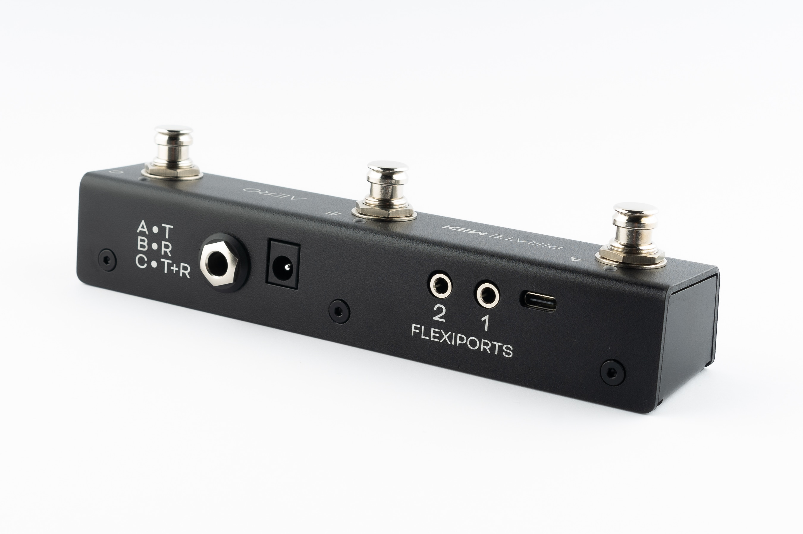

# QUICK START

## HARDWARE LAYOUT

1.  **Footswitches**: 3 SuperSilent footswitches. Almost inaudible. Work with multiple press types (double-press, hold, etc).
2.  **Enclosure**: Heavy-duty aluminium enclosure with black anodising. Scratch-resistant and no flex.
3.  **LEDs**: RGB LEDs which you can assign to any colour you like for any function you like. Flashing, solid, dim etc.
4.  **Aux Jack**: Dedicated 1/4" TRS aux jack - completely passive
5.  **DC Power**: 2.1mm 9v DC barrel jack - as standard on most effects pedals and power supplies. Centre negative.
6.  **Flexiports**: Flexiports 1 and 2. Multi-function 3.5mm TRS jacks which can be used in a number of different modes.
7.  **USB**: USB type C Device port - for USB MIDI, using the web editor, and powering the device.

---

## 1. Using As Passive Aux Switch
Plug a 1/4" TRS cable from the 1/4" jack on the rear of the Aero to your target device. If your target device only uses a TS connector, you will not gain any extra functions from 3 switches - only 1 or 2 of the switches will perform functions depending on the design of the original manufacturer.

## 2. Using Aux Switch + RGB LEDs
To add RGB LEDs to your aux switch to help you keep track of functions, you will need to set the appropriate switch modes in the [web editor](https://edit.piratemidi.com). Toggle, Momentary, and Sequential modes all offer different features to match what your target device might be doing. When you've sent the config from the editor to the Aero, power your Aero while it's plugged into the target device and now you'll have LEDs functioning at the same time as using the passive aux features.

## 3. Full MIDI Controller
Plug your Aero into your computer, and go to edit.piratemidi.com - set a switch mode for each switch, and then add MIDI Messages, Smart Messages, or Keyboard Messages. To save time, you can use our Device Library to add factory default MIDI messages to your config without searching through user manuals! Smart Messages can be used to scroll through banks on the Aero to access more controls. Flexiport Modes can be set to allow expression pedal input, Device Link mode to connect to a Bridge6 or Bridge4 controller, or send MIDI out in any of the standard TRS MIDI types (Type A, Type B, Tip Active, and Ring Active).