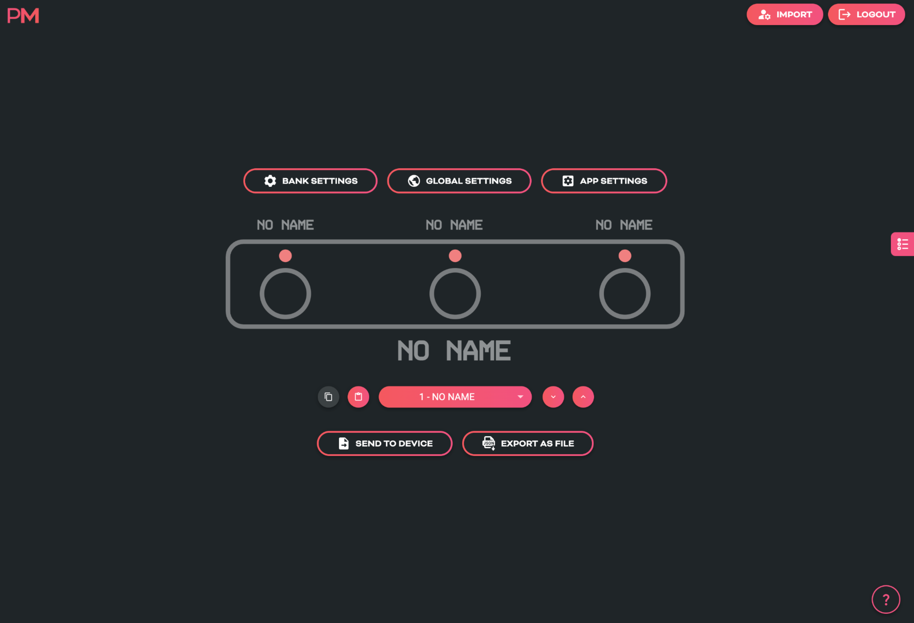

# AERO MIDI CONTROLLER
**USER MANUAL (V2.1.8)**

---

## AERO OVERVIEW
The Aero is a 3-switch passive TRS aux switch, and a MIDI foot controller with RGB LEDs, SuperSilent switches, and many exciting features. It is made in New South Wales, Australia and is built on the famous BridgeOS of our other MIDI controllers.

Without any external power, the Aero can be used as a standard aux switch for any TRS aux or footswitch jack on your amp, non-MIDI pedals, synths, and more. If you power the Aero and still only use it as an aux switch, you can use the editor to set LED colors to correspond to your aux switch functions.

The Aero can also send stacks of MIDI messages through different footswitch press types (Press, Hold, Double-Press etc.) with 128 different bank of switches to scroll through. This means that the 300+ MIDI messages on each bank can be individually assigned across the whole device for a total over more than 35,000 unique messages and controls.

To help you connect to a wide variety of music gear, we've included two Flexiports of our own design. These 3.5mm TRS jacks can be set to whatever mode best suits your setup. From expression pedals to beat sync pulse to switch emulation, you can use this MIDI controller to control devices that don't even have MIDI!

All the settings are editable using our web editor, and many of the global settings and features can be triggered remotely by sending MIDI to the Aero over USB or Device Link connection.

---

## TECHNICAL INFORMATION

* **Dimensions**: 175x50x45 mm / 6.9"x2"x1.8"
* **Weight**: 220g / 7.7 oz.
* **UI**: 3x ARGB LEDs
* **Box Contents**: 1x AERO MIDI Foot Controller, 1x USB Cable
* **Power Requirement**: 9v DC or USB (150mA)

!!! Attention
    It's important that firmware updates are installed when they are available. Old firmware may not be supported by the web editor. 
    
    Firmware updates are released frequently and offer new features, bug fixes and other improvements. User manuals are updated for each firmware update according to new features and changes.

---
## QUICK START

### HARDWARE LAYOUT

1.  **Footswitches**: 3 SuperSilent footswitches. Almost inaudible. Work with multiple press types (double-press, hold, etc).
2.  **Enclosure**: Heavy-duty aluminium enclosure with black anodising. Scratch-resistant and no flex.
3.  **LEDs**: RGB LEDs which you can assign to any colour you like for any function you like. Flashing, solid, dim etc.
4.  **Aux Jack**: Dedicated 1/4" TRS aux jack - completely passive
5.  **DC Power**: 2.1mm 9v DC barrel jack - as standard on most effects pedals and power supplies. Centre negative.
6.  **Flexiports**: Flexiports 1 and 2. Multi-function 3.5mm TRS jacks which can be used in a number of different modes.
7.  **USB**: USB type C Device port - for USB MIDI, using the web editor, and powering the device.

---

### 1. Using As Passive Aux Switch
Plug a 1/4" TRS cable from the 1/4" jack on the rear of the Aero to your target device. If your target device only uses a TS connector, you will not gain any extra functions from 3 switches - only 1 or 2 of the switches will perform functions depending on the design of the original manufacturer.

### 2. Using Aux Switch + RGB LEDs
To add RGB LEDs to your aux switch to help you keep track of functions, you will need to set the appropriate switch modes in the [web editor](https://edit.piratemidi.com). Toggle, Momentary, and Sequential modes all offer different features to match what your target device might be doing. When you've sent the config from the editor to the Aero, power your Aero while it's plugged into the target device and now you'll have LEDs functioning at the same time as using the passive aux features.

### 3. Full MIDI Controller
Plug your Aero into your computer, and go to edit.piratemidi.com - set a switch mode for each switch, and then add MIDI Messages, Smart Messages, or Keyboard Messages. To save time, you can use our Device Library to add factory default MIDI messages to your config without searching through user manuals! Smart Messages can be used to scroll through banks on the Aero to access more controls. Flexiport Modes can be set to allow expression pedal input, Device Link mode to connect to a Bridge6 or Bridge4 controller, or send MIDI out in any of the standard TRS MIDI types (Type A, Type B, Tip Active, and Ring Active).

---

## 1. Device Interface

### Footswitches
Three silent footswitches are the main interface on the Aero. Rated for over 100,000 presses each, they can send different MIDI message stacks for different press types (Toggle On, Toggle Off, Press, Release, Double Press, Hold, Hold Release etc). Each switch can send many different messages, and can be configured differently on every bank:
* **Toggle On**: 64
* **Toggle Off**: 64
* **Press**: 16
* **Release**: 16
* **Hold**: 16
* **Hold Release**: 16
* **Double Press**: 16
* **Sequential Steps**: 64
* **Scrolling Messages**: 64

### RGB LEDs
Each switch is paired with an RGB LED that can be customised to any colour. Custom colours can be created on the device, in the web editor, or sent to the device with the API or MIDI commands. LEDs change their functions based on the switch mode that is currently set. This includes dim/on and off/on choices, flashing with MIDI clock, and more.

---

## 2. Power & Navigation

### Powering Your Aero
You can power your Aero with either a USB cable, or a centre-negative 9v DC jack (2.1mm) commonly used for guitar pedals.

### Switching Power Sources
The Aero uses smart power switching so you can have both cables plugged in at once, and if you need to remove one or the other, the unit will seamlessly switch power sources without shutting down or restarting.

!!! warning "Power Requirement"
    If you’re using a 9v DC power supply, please make sure it can supply the required 150mA.

### Basic Navigation

#### Switching Banks
Because of the way an aux switch works, there is no way for the device to know when two switches are pressed simultaneously. Because of this, bank navigation is limited to press actions on a single switch using Smart Messages. Smart Messages can increment/decrement banks or target a specific bank number.

Alternatively you could plug another aux switch into a Flexiport and use it to control banking to leave the switches of the Aero free for other tasks. 

There are 128 banks. Banking up from bank 128 will return you to bank 1. Banking down from bank 1 will send you to bank 128. Please note that banks can be counted using 0-127 or 1-128 numbering depending on the manufacturer.

### Web Editor Features for Navigation

#### Global Settings
Aero settings can be modified inside the web editor to make one switch trigger bank up or
bank down globally regardless of the current preset.

#### Switch and Bank Labels
Even though the Aero doesn’t have a screen, we have included switch labels and bank names
in the device’s config data which is transferrable between the device and the web editor. This
will help you to keep track of what messages and features you have set up on a given bank or
switch even if it is months between sessions using the web editor.

---

## 3. Overview of Connectors

### USB (type-C): 
The Aero can be powered by USB, and is also a class-compliant USB MIDI device. This means it will be recognised as a MIDI device without any drivers. Use it with your DAW, plugins, or music apps. The USB port is not a USB Host port.

### 9v DC (centre-negative)
 A 2.1mm centre-negative barrel jack (common with standard guitar pedal power supplies). Requires 150mA.

### 1/4” TRS Aux Jack
A 1/4” TRS Jack that is directly connected to the 3 switches on the Aero using the same electrical circuit that any other triple aux switch uses. Switches A, B, and C, are labelled on the rear of the enclosure to show which connector of the TRS cable they represent.

### TRS Flexiports 1 & 2
 3.5mm TRS jacks with 8 modes: MIDI Out (Type A, Type B, Tip Active, Ring Active), Device Link, Exp-Doubler In, Expression In, Aux Switch In. 
 
 The extreme flexibility of the Aero is due partly to the two Flexiports we’ve included. The Flexiport is a multi-function TRS port that we’ve designed (and named) to give you a truly flexible experience with our devices.

 !!! note
    Flexiports are included in most Pirate MIDI devices and offer slightly different mode selection based on the device's target use cases.

## 4. Flexiports

### Flexiport Modes Summary
The Flexiport is a multi-function TRS port that can be configured in the web editor to suit your specific hardware needs. Each port can be set independently to any of the following modes:

1. **MIDI Out - Type A:** Can power CME WIDI devices. Type A is the MIDI TRS standard. 
2. **MIDI Out - Type B:** As used by Arturia, Novation, and others. Will usually work with newer Chase Bliss Audio pedals. 
3. **MIDI Out - Tip Active:** Empress, Alexander Pedals, Meris, Bondi Effects and more. 
4. **MIDI Out - Ring Active:** Chase Bliss Audio
5. **MIDI In:** Only works with our [MIDI In adapter for Flexiports]() 
6. **Device Link:** Connect multiple Pirate MIDI devices together.
7. **Exp-Doubler In:** Enables two expression pedal inputs per Flexiport with our Expression Mate or Exp-Doubler devices. 
8. **Exp In:** Single TRS expression pedal input. 
9. **Aux Switch In:** 1, 2, or 3 switch TRS aux switches supported. Add more footswitches to your controller.

!!! Danger "Flexiport Warning"
    Other Pirate MIDI devices may offer different Flexiport modes. Connecting a device to the Flexiports when the Flexiport is not set to a compatible mode may damage your device and void your warranty. 
    
    Please make sure your Flexiport is set to the correct mode **before connecting the device to the Flexiport.**

### MIDI Out
When set to ‘’MIDI Out’ mode, the Flexiport is a dedicated MIDI TRS Output. There are 4 MIDI Out modes: Type A, Type B, Tip Active, & Ring Active. You can choose the MIDI Out mode in the Global settings menu in the web editor.

TRS A is the standard MIDI specification for TRS MIDI. It use the ‘Tip’ to send MIDI. However, because MIDI over TRS was introduced before the specification was decided, there are some brands that send on the ‘Ring.’ This is called TRS B.

Again, there are other brands who do not adhere to the specification and only use two pins, instead of three to send MIDI data. Brands such as Empress, Meris, Bondi Effects, Alexander Pedals, and Chase Bliss Audio use either Tip active or Ring active modes.

If you are unsure which pedals or devices use which mode, a quick google will probably answer your question. If you’re having trouble finding out, feel free to ask in our Facebook group which will get the fastest response, or you can ask us in an email to support@piratemidi.com

Once the Flexiport is in MIDI Out mode, any messages that have their MIDI set to be output to that Flexiport will be transmitted out that Flexiport when the messages are triggered.

### Expression Pedal In
Expression pedals will sometimes not register their full range on different devices they connect to. Calibrating your expression pedal will make sure that toe-down is equal to the maximum MIDI value (127) and heel-down is equal to the minimum value (0).

*Currently calibration of expression pedals is not implemented on the Aero, but we will add it in a future firmware update.*

### Exp-Doubler In
When set to “Exp-Doubler In” mode, usage is the same as “Exp In” including calibration etc. but this mode can only be used with the PIRATE MIDI Exp-Doubler.

An expression pedal usually works with three contacts: Tip, Ring, and Sleeve. The Ring supplies power, the Sleeve is connected to ground, and the Tip transmits the position of the pedal.

Our Exp-Doubler supplies power to the Ring of your expression pedals which leaves an extra slot on the Flexiport for receiving the pedal position. Across two Flexiports this means up to 4 expression pedals can be used! Two per Flexiport. This is why Expression pedals and their message stacks are labelled as 1A and 1B, 2A and 2B. 1A and 2A are the "single", and 1B and 2B are used only in Exp-Doubler In mode. 

### Aux Switch In
When set to ‘’Aux Switch” mode, the Flexiport will receive auxiliary switch input for extra footswitch controls. Set the Flexiport mode in the global settings menu.

Single, double or triple auxiliary switches will work in this mode. Plug your aux switch into your Flexiport and then assign it a function or MIDI command in one/both of the Global and Bank Aux Settings.

You can assign messages for up to 3 auxiliary switches (Tip, Ring, Tip+Ring). The available messages are Press, Hold, Toggle On, and Toggle Off.

These messages are available to configure individually for every bank, but also globally. This means that each switch can send 2 messages at once for press, toggles, and holds. All message
types, including smart messages and keyboard messages, can be assigned to Aux Switches.

### Device Link
When set to “Device Link” mode, the Flexiport acts as a high-speed communication port to link two PIRATE MIDI devices for transfer of MIDI messages and other commands. Activate Device Link mode in the global settings menu of the web editor under “Flexiport Settings” and then “Device Link Settings” for the more specific options related to Device Link mode.

Device Link can sync bank changes, bank names, merge switch groups to interact between devices, and stream MIDI from one device to the MIDI out of a different device.

#### Setting the Main/Satellite Roles
To choose which device will broadcast it’s bank name and act as the Main device, select the “Role” as `Main` or `Satellite` in the Device Link settings of the web editor.

#### Device Link Settings
In the above-mentioned menu, there are currently 5 options after the Main/Satellite choice.

**Bank Name**
Temporarily overwrites the displayed bank name on the Satellite device with the bank name of the Main device when connected to the Device Link network. 

!!! note 
    The bank name is not replaced, and when disconnected the original bank names are retained on the satellite device.

**Bank Navigation**
Synchronise bank changes between devices. Similar to how a PC message would normally cause a bank change, but without using up message space.

**MIDI Receive (RX)**
MIDI messages are received via the high-speed device link connection, and output to the MIDI outputs as per the MIDI Thru Flexi1/2 routing set in the Global “MIDI Thru” menu. To send a message to the device link network, make sure the message’s outputs have the Flexiport set to `on`. 
If Device Link is through Flexiport 2, make sure the message outputs haven Flexiport 2 set to `on`.

**Footswitch Groups**
Switch Groups are merged across the network. Members of group ‘x’ (e.g. 1) on all devices interact as if they’re in the same group. There is no consequence to disconnecting from the Device Link network. The switch group settings will simply interact with the switches on that device.

**Sequential Switches**
Switches set to Sequential Mode that have been added to a switch group can have their sequential step triggered by another switch in the group depending on the switch group settings (See the chapter covering Switch Groups). This included sequential switches in the same group across a Device Link connection.

---

## 5. MIDI In/Out/Thru

### MIDI Out
To send MIDI from your Aero to another device, you can use the 3.5mm TRS Flexiports. If you need to convert to DIN5 or 1/4” TRS, adapters are available online or on our website.

MIDI Out (Type A) Flexiport mode will power a CME WIDI device.

This output is activated by default on new messages, but when editing an existing message, it’s best to check that the correct output is activated.

#### MIDI In
There is no dedicated MIDI input on the Aero. When connected to a USB host, the Aero can receive USB MIDI, and when in Device Link mode, it can stream MIDI from the other Device Link devices that are connected and pass those messages to the Aero’s outputs.

#### External MIDI Control
Using the MIDI commands detailed in the “MIDI Implementation” chapter at the end of this manual, you can send MIDI commands from another device to the Aero to control various features such as bank changes, sequential step position, switch emulation and much more.

#### MIDI Thru
There is no dedicated MIDI Thru jack on the Aero, however the digital MIDI Thru routing is very flexible.

To set the MIDI Thru routing go to the Global MIDI Settings in the web editor.

This menu allows you to choose which MIDI Outs (Flexi 1, Flexi 2, USB) the MIDI messages received on the chosen input (USB or TRS In) will be sent to. 

!!! tip 
    MIDI can only come into the Aero through USB or Device Link unless you're using the MIDI In adapter and the MIDI In Flexiport mode.

For example, if you choose to turn on MIDI Thru routing from the USB In to Flexiport 1, any message received on the USB In will be sent to Flexiport 1 if it is in a MIDI Output mode. But it will not be sent to the USB out or the other Flexiport unless they are also set to ‘on’ in the Thru routing settings.

Flexi1 and Flexi2 thru settings are only used when the Flexiport is being used as a Device Link port. MIDI cannot be received via a Flexiport except when using the Flexiport in Device Link mode.

!!! warning
    MIDI can be looped back to outputs, but you should be careful not to create unintentional infinite loops. If a message is sent from the Aero USB port, and the device it is connected to is set to send the MIDI back to the Aero and you also have the MIDI Thru routing settings on the Aero set to send MIDI in to the MIDI out, you will have an infinite loop as both the Aero and the USB device send the MIDI thru from their input to their output.

## 6. USB & USB MIDI

Your Aero is a class-compliant USB MIDI device. This means you can plug it into any kind of USB host (Windows, Mac OS, iOS, Android, iPadOS) and it will automatically be recognised as a MIDI device to control or receive messages from any DAW, app or plugin. It is also a plug-and-play HID (keyboard) device which means you can send keystrokes and key-command macros to these USB host devices.

### USB (type-C)
USB MIDI requires a USB host device. A host device can be a computer, tablet, phone, or some kind of USB MIDI host box designed to link a pedal with USB directly to a MIDI controller without needing a computer-like device.

The Aero does not offer itself as a USB host and therefore cannot be directly linked from USB to USB on pedals such as the Zoom multistomp series.

A USB host device like the CME WIDI UHOST will be a great addition to your Aero. Plug it into your USB port and go wireless! It also means that as a USB host device, you can connect the WIDI UHOST to a WIDI Jack or similar and use the USB MIDI in/out as another general MIDI in/out to the device the WIDI Jack is plugged into.

The USB port receives power as well as USB MIDI.

!!! note 
    iPads/iPhones/Android etc. may not provide enough power from their USB port to power the Aero. In that case, you would need to power it via a powered USB hub or the DC jack. 

## 7. Messages & Modes

You can program all the functions of your Aero with the onboard menus or the web editor. We’ve made both methods as straightforward as possible so you can quickly get up and running. Here’s an overview of what you can do when programming your Aero. Step-by-step instructions for these methods will be covered in later sections.

### MIDI Messages

Note On, Note Off, Poly Pressure (Aftertouch), Control Change (CC), Program Change (PC), Channel Pressure, and Pitch Bend messages can be set as the message type for any MIDI message on the Aero.

In addition to the types above, real-time messages such as MIDI clock, start & stop messages can be sent when a footswitch is set to “MIDI Clock” mode.

MIDI thru functions will pass through any and all valid MIDI data, even if it happens to be a data type that the Aero does not yet support - such as SysEx messages.

!!! note 
    MIDI Notes are numbered with C3 = Note #60. Please note than some manufacturers will mark C4 as Note #60, so if you’re having trouble, please take this offset into consideration when testing any issues you might have. Setting C3 instead of C4 or F#2 instead of F#3 may solve the issue

### Smart Messages
Along with MIDI messages, you can also control complex features and internal functions of the Aero with smart messages. Smart messages can be set to:

• Bank Up
• Bank Down
• Bank Select (Go to Bank)
• Last Bank (Jump to previously accessed bank)
• Increment Expression Message
• Decrement Expression Message
• Go to Expression Message
• Switch On
• Switch Off
• Switch Toggle
• Reset Sequential
• Increment Sequential Step
• Decrement Sequential Step
• Set Step Sequential
• Queue Next Sequential Step
• Queue Sequential Step
• Reset Scrolling
• Increment Scrolling Value
• Decrement Scrolling Value
• Set Value Scrolling
• Queue Next Scrolling Value
• Queue Scrolling Value

### Key Press Messages
Instead of a MIDI message, you can place a keyboard message in any of the message stacks across the device. Key press messages cover the standard 104 keys of an ANSI HID keyboard.

“GUI” or “Meta” is the name of the Windows key or MacOS’ “Command” key.

A key press message is composed of up to three keys that can be sent at once. For example, “Ctrl + Alt + Delete”, “Ctrl + S”, or “I + L + Y” are all possible with a single key press message. Multiple messages can be added to a message stack of course, just like any MIDI or smart messages.

### Primary Footswitch Modes

Each footswitch has a number of possible modes which are set in the switch config menu and can be
customised to be different for all 128 banks. They are indicated by the LED. These are set in the `Switch Settings` menu in the web editor.

#### Toggle
This is the default switch mode. In this mode there are 4 different switch press types: Toggle On, Toggle Off, Press, Release.

With each press, the state of the switch is toggled to be the opposite of the state it was in (`On` > `Off`, `Off` > `On`).

When setting MIDI messages in these stacks, the number of messages you can add to the stacks are: 

• Toggle On: 64
• Toggle Off: 64
• Press: 16
• Release: 16

The LED will be toggled between `on` and `off` along with the switch state.

In the Global settings you can choose whether changing banks will preserve the toggle states of switches, or whether all switches' states reset when changing banks.

#### Momentary
This sets a switch to ignore Toggle On and Toggle Off messages and acts as a switch that turns on only when being pressed. 

Each press will trigger the `Press` messages stack which has a limit of 16 MIDI messages per switch, per bank. 

All other message stacks are still able to be triggered when a switch is in momentary mode (e.g. double press, hold, etc.)

Message limits are unchanged. The LED will be turned on when the switch is being pressed and will be off when not being pressed. 

#### Tap Tempo
This sets a switch to control your MIDI clock. This mode is exclusive, and no other messages can be sent by a switch in Tap Tempo mode.

Tapping the footswitch will act like a tap tempo switch - changing the tempo in time with your taps (including tap averaging). The LED will flash to show the current tempo. The colour of the LED can be customised.

Holding down the footswitch will start or stop the MIDI clock by sending the special “MIDI Clock Start” and “MIDI Clock Stop” MIDI messages as per the MIDI specification.

#### Sequential
This mode will activate each message in the “Sequential” message stack individually, one at a time, when you press the footswitch. You have the option of making the last few messages repeat in a loop or reversing the messages back to the first step. You can use a maximum of 64 steps and 64 messages. The messages can be distributed unevenly across the number of steps you choose. For example, you could have 10 messages on step 1, and 2 messages on step 2, and 52 messages on step 3!

**Example 1:**
In a message stack consisting of 3 messages, message 1 will be sent on the first press, message 2 will be sent on second press, message 3 will be sent on third press, and then message 1 will be sent on the fourth press - starting the sequence over again.

**Example 2:**
In a message stack consisting of 3 messages for controlling an audio looper, a “record” message will be sent on the first press, a “play” message will be sent on second press, an “overdub” message will be sent on third press, and then subsequent presses will continue to cycle between “play” and “overdub” without going back to the “record” step.

**Direction**
`Forward` will send all sequential steps from first to last. Reverse will send steps from last to first.
`Pendulum` will go from first to last, and then reverse the sequence from last to first. 
`Random` is self-explanatory.

**Send**
`Always` will send the sequential step message/s immediately as the step is selected. `Secondary` changes this so that the message/s are only sent when the secondary switch function (e.g. Hold) is activated. 

Use this to queue a step and send it when you’re ready to fire the message. Likewise `Primary` will specify that the message/s will be sent when the Primary switch action is triggered.

**Repeat**
This option chooses what happens after reaching the end of the sequential step list. `Last 2` & `Last` 3 will repeat the last 2 or 3 steps in the sequence. 

This is useful for live looping where the first message or two may start the recording mode, and the rest of the commands are used for overdubbing and recording new loops. All will simply cycle through the steps again after reaching the end of the “direction.”

#### Sequential Linked
This mode lets you link to another Sequential mode footswitch within the current bank but change parameters such as the direction or the send mode. Useful for having two switches linked for forwards/reverse switch pairs.

#### Scrolling
This mode uses the “Scrolling” message stack and will scroll the value of any messages placed in the stack. This can be useful for scrolling through modes or presets or snapshots on other apps or devices.

You can use a maximum of 64 messages which can be simultaneously scrolled with different starting offsets based on the value the message is entered with.

**Direction**
`Forward` will send all values from Min to Max. 

`Reverse` will send values from Max to Min.

`Pendulum` will go from Min to Max, and then reverse from Max to Min. 

`Random` is self-explanatory.

**Send**
`Always` will send the scrolled message immediately as the scroll is initiated. 

`Secondary` changes this so that the message is only sent when the secondary switch function (e.g. Hold) is activated.
Use this to queue a step and send it when you’re ready to fire the message.

`Primary` will specify that the message/s will be sent when the Primary switch action is triggered.

**Min/Max**
This limits the values that the scroll will cover. When you add a message to the "Scrolling” stack, the value you choose is where the scrolling will start from, but it will stick to the limits of these settings once it reaches the maximum. 

!!! tip
    Set the value on the message itself to offset multiple messages in the scrolling stack.

**Step Size**
This option sets the increment/decrement size of the scrolling value. Value can be set from 1-32. If the value of the messages as-saved is 0 and the step size is 3, the next value sent after 0 will be 3. If the step size is 32, the values 0-127 will be covered in 4 presses.

!!! note 
    The starting value of the message as-saved will impact the first message sent. The value as-saved will not be sent on the first press.
    
    If you need the first press to be a value of 0, you should use your step size to count backwards from 0 (down through 127) to choose the value you save for the message.

#### Scrolling Linked
This mode lets you link to another Scrolling mode footswitch within the current bank but change the direction of the scroll and the send mode. 
This is useful for having two switches linked for `Forward`/`Reverse` switch pairs.

### Other Footswtich Modes

#### Double Tap Toggle
This mode activates the “Toggle On” and “Toggle Off” message stacks when you double tap the switch. 

This is the same as the Toggle mode, but activated by a different switch press.

#### Hold Toggle
This mode activates the “Toggle On” and “ Toggle Off” message stacks when you hold the switch. 

This is the same as the Toggle mode, but activated by a different switch press.

#### Double Tap Momentary
This mode allows you to activate the Double Tap message stack with a double press of a footswitch. 

The double press message stack is limited to 16 messages.

#### Hold Momentary
This mode allows you to activate the Hold message stack with a long press of a footswitch. Hold time is adjustable in the Global Interface settings.

Hold and Hold Release message stacks have an 16 message limit.

!!! note
    Most message stacks will still be editable when editing MIDI messages, but the footswitch mode will determine which stacks are able to be activated/sent by footswitch presses.

### Expand and Improve Your MIDI Routing
Each message can be individually tailored to go to any combination of the MIDI outputs available. When creating a message, turn the desired MIDI output/s (`USB`, `Flexi 1`, `Flexi 2`) `On` or `Off` to create different streams of MIDI messages from one switch press.

!!! example
    Output the first 16 messages from `Flexi 1`, the second 16 from `Flexi 2`, and the third 16 from the `USB` MIDI out. By using all 16 MIDI channels on each output (message 1/channel 1, message 2/channel2) this will result in 48 different devices able to be MIDI controlled by a single footswitch press with no conflicting MIDI channels.

    

### LFOs
Low Frequency Oscillators are not just for sound waves. With MIDI messages, we can oscillate the value data at low frequencies to modulate the MIDI data automatically and create ‘moving’ MIDI messages.

For example, a TC Electronics Plethora X5 has 5 knobs which are also controllable with MIDI CCs. By applying the LFO to one of those MIDI CCs, the Aero can continually (and automatically) ‘move’ that knob. Many effects units have parameters that can be controlled in this way. 

Almost every parameter on multi-effects units like the Line6 Helix and Fractal Audio devices can do this. 

The Aero’s LFOs can be set to activate with the switch actions. This can product a “toggle” type or “momentary” type effect (i.e. press once to turn on, press again to turn off, OR press to activate, release to stop) The LFO will oscillate all possible MIDI messages that are in the chosen MIDI message stack. 

All three LFOs can be simultaneously active.

The LFOs can be linked to MIDI Clock, or set with an independent frequency from 0.1hz to 10hz. Min/Max value limits can be set to limit the range of oscillation, and the waveform can be changed between sine, triangle, saw, ramp, square, and random.

Adjust the steps to change the resolution of the modulation, and choose whether to reset the waveform after each stop, or pick up where the wave was paused.

With three LFOs running on a bank and flexible MIDI routing, you can oscillate more than fifty MIDI messages on each of the 128 banks! But you will have to be careful of the limitations of MIDI itself. Being such an old protocol, it takes approximately 1ms per MIDI message and can become quickly overloaded with LFO data. USB MIDI is not usually as limited in this regard.

!!! tip
    If you are experiencing stuttering, try increasing the step size of the LFO and trying again, or decreasing the number of MIDI messages being oscillated at once.

### Expression Pedals
With each Flexiport able to take an expression pedal input, or an Exp-Doubler input, you can do a lot with expression pedals on the Aero!

Each expression pedal can control a stack of bank expression messages and a stack of global expression messages. 16 Global and 8 Bank-level expression messages means you can control 24 messages per expression pedal at any one time.

Each individual message can be routed to any selection (or all) of the available MIDI outputs and can be set with min/max limits and `linear`, `log`, or `anti-log` interpolation curve. 

You can also reverse the sweep so that the lowest value will be sent at the toe-down position and the highest value at the heel-down position. 

!!! example
    You could have an expression pedal that controls a global CC7 (volume)message, and another expression pedal that controls the tremolo depth of another effect but is limited to a range of 40%-70%. This same expression pedals could simultaneously modulate reverb size, time, and pre-delay, and perhaps also link to a low pass filter on an EQ effect.

    For a truly ‘experimental’ sound, try linking 16 different parameters to one expression pedal, all with different min/max limits and sweep curves!

You can also use smart messages on a footswitch to scroll through the messages in an expression message stack one at a time or select a specific expression message.

!!! example 
    You could have an Aux switch which scrolls between the 16 expression messages. 16 expression pedals for the price of one (plus a small footswitch to scroll through them, of course).

### Expression Ladder Messages
Expression ladder messages are messages that are triggered by the position of the selected expression pedal. Up to 128 messages per Flexiport, per bank can be added as well as 128 global expression ladder messages per Flexiport. This means a total of 256 messages per Flexiport can be triggered by the positions of a single expression pedal!

Use this feature to simulate a heel switch or toe switch on your expression pedal. These can be used to trigger tuners, turn effects on/off etc.

Ladder messages are set the same way as any other message, except there is a `trigger` setting. This is a value selected from 0-127 and represents the position of the expression pedal. `0` = heel down and `127` = toe down.

!!! note
    If you are using the Expression Doubler on your Flexiports, these ladder messages will be tied to the 1A and 2A expression pedals and can’t be used with the 1B and 2B pedals.

### Aux Switches
An Aux switch, connected to a Flexiport, can have up to 3 switches using a TRS cable. The Aero can register press, toggle and hold events from an Aux Switch.

The press, toggle, and hold events can trigger one message each (including smart messages) per bank, and there is also a global setting for each message type.

This means you could use two Aux switches to add 6 more switches to your Aero and each of those switches can send 8 more messages, including triggering other switches (or switch groups).

### Boot Messages & Boot Delay
You can add up to 64 messages of any type that are sent as soon as your Aero is turned on. This is useful for making sure your connected gear is set to a “default” or “beginning” state without having to check everything.

Set the Boot messages in the Global Settings in the web editor.

Boot delay is a complimentary setting found in the Global Interface settings.
You can increment the boot delay by 100ms from `0ms` to `60000ms` (60 seconds) to allow other gear to power on before the Aero sends the Boot messages.

### Device Link
Connect two or more PIRATE MIDI devices via Flexiport (in Device Link mode) to enable high- speed MIDI input/output sharing, bank change sync, bank name sync, UI settings sync, and other features to come!

Want a MIDI controller with 9 switches? No problem, connect a BRIDGE6 and an Aero with a TRS cable and away you go.

Device Link automatically detects what devices are connected and what their features are so you get an easy, flexible setup no matter what your combination of devices may be. See chapter 4 (Flexiports) for full Device Link details.

## 8. MIDI Clock

### MIDI Clock Onboard
The Aero has onboard MIDI Clock with advanced routing options.

#### 1. Assigning MIDI Clock to a Footswitch
To assign the MIDI clock to a switch, change the switch mode to "Tap Tempo" in the web editor.

**LED Indicators**
The LED color and mode can also be changed in the switch settings menu.
The LED will flash the current tempo and update as you tap a new tempo.

**Sending `Start` and `Stop` Messages**
To send a `Start` message, press and hold the switch. The clock does not send a Start message until you perform this hold action. However, MIDI clock is designed to always be sending timing pulses, so your device will probably see the new tempo before you send a Start message. 

!!! note
    Some devices do not use the `Start` and `Stop` MIDI clock messages at all.

To send a `Stop` message, press and hold the switch. The LED will keep flashing, and the clock timing messages will continue to be sent as mentioned above.

#### 2. Assigning MIDI Clock Outputs
To choose which MIDI outputs each MIDI clock will be sent to, go to the Global MIDI settings in the web editor.

Here you can select any or all of the MIDI outputs (`Flexi1`, `Flexi2`, `USB`) for that clock to be sent to.

#### 3. Preset or Inherit MIDI Clock Tempo Per Bank
You can preset the tempo for the MIDI Clock on each bank. You can also set the bank to simply inherit the tempo of the bank you’ve just changed from (works with non-linear bank changes too). 

To set the tempo or `inherit` setting, go to Bank Settings in the web editor.

#### 4. Controlling Clock Tempo with MIDI
You can set the tempo for the MIDI clock using external MIDI commands sent to the Aero.

Clock tempos can be adjusted using CC 73 and CC 74 as NPRN-style pairs. (NRPN is a way to extend the range of values of a MIDI CC by using two CC’s together instead of just one).

CC 73 both sets the target clock, and the tempo range. CC 74 is purely for tempo.
How does this work? 

`CC73` (MSB), Value = 0 : Clock A set between 45 (minimum) to 127 BPM
`CC73` (MSB): Value = 1 : Clock A set between 128 to 240 (maximum) BPM
`CC74` (LSB) sets the tempo as dictated by CC73.

???+ example "Example 1"
    You send CC 73, value = 1, then CC 74, value = 12. 

    This is targeting Clock A in the 128-240 BPM range. 
    
    Starting from 128, you add the value of CC74 which gives 140BPM.

???+ example "Example 2"
    You send CC 73, value = 0, then CC 74, value = 67. 
    
    This is targeting Clock A in the 45-127 BPM range. 
    
    Starting from 45 as the minimum value, 67 will set the tempo to 67.

!!! note
    These MIDI implementation values are also noted in the table in the MIDI Implementation section of this manual. 

## 9. LFOs

### Setting LFOs
The Aero has three LFOs per bank that can run simultaneously and independently with deep customisation and flexibility.

LFOs are assigned to a particular message stack on a particular switch. When active, the LED becomes an indicator of the LFO, showing both frequency and wave shape with the pulsing/ fading of the LED itself.

To start setting LFO parameters, go to LFO Settings under the switch configuration page on the web editor.

The following headings address each of the LFO settings available.

#### 1. LFO State
Toggle this setting between `on` or `off` to activate or deactivate the LFO.

#### 2. Sync Mode
For each LFO you choose to activate, you can set a `free` frequency (default) or choose to sync to MIDI `clock`.

#### 3. LFO Frequency
his sets the frequency of the oscillation from the minimum value to the maximum value. In free sync mode, this is set in Hertz (times per second). The Hz range is from `0.1Hz` to `10Hz`.

When synced to MIDI clock, the frequency is set as a time division of the tempo.

**Available Time Divisions:**
• 1/4
• 1/4 Triplet
• 1/4 Dotted
• 1/8
• 1/8 Triplet
• 1/8 Dotted
• 1/16
• 1/16 Triplet
• 1/16 Dotted

#### 4. LFO Trigger
There are two options for triggering the LFO. `Toggle` or `Hold`.

`Toggle` will start the LFO after pressing the footswitch, and it will continue to run until you press the footswitch again to turn it off. This is useful for auto-panning, auto-wah, oscillating frequencies with an EQ or other constant modulation.

`Hold` will run the LFO only while you hold down the footswitch. This is useful for one-off intentional parameter changes, or for on-the-fly virtual knob twisting (press and hold to slowly turn up the MIDI-controllable gain knob on your drive pedal) or for ramping effects like opening a cutoff filter.

#### 5. LFO Limits
The Min Limit and Max Limit parameters set the range that the LFO will oscillate between. If you want to limit the range of oscillation to be smaller than the full 0-127 values of a normal MIDI message, use these limits.

!!! example
    I may use an LFO to auto-wah with an EQ, but I don’t want to cover the whole sound spectrum - I just want to oscillate in the mids to high mids. So I set the Min Limit to 60 and the Max Limit to 100. 
    This contains the parameter I’m modulating to just the upper mid section.

#### 6. LFO Shape (Waveform)
You can choose from 6 different waveform shapes to moldulate your MIDI data: 

• Sine
• Triangle
• Saw
• Ramp
• Square
• Random 

!!! tip "`Random` Wave Shape Tip" 
    Set the step size. If a random value is within the step size, it will regenerate to create a new value outside the step size of the previous value generated. 

#### 7. LFO Messages
This setting allows you to choose the message stack that the LFO will modulate. Any compatible message in this stack will be what the LFO uses to create the oscillating MIDI data.

For instance, if you choose the toggle on stack, then any messages in the toggle on stack are what the LFO will oscillate. If there are 12 MIDI CC messages in that stack, all 12 will be oscillated with the settings chosen.

#### 8. LFO Modulation Source
Not currently active. Please wait for a future update.

#### 9. LFO MOdulation Target
Not currently active. Please wait for a future update.

#### 10. LFO Reset
Choosing `Yes` will reset the waveform each time you start or restart the LFO. Choosing `No` will keep continuous data between stops.

!!! tip 
    Turning reset to `No` is helpful for continually ramping parameters when using the ramp shape rather than going back to the `min` value each time you activate the LFO, you can increase it gradually in multiple stages by starting and stopping the LFO a few times.

#### 11. LFO Step
The ‘Step’ refers to how smoothly the LFO changes the data of the MIDI messages. A step of `1` means that the data will only change by +/- 1 each time. You can set the step value to `1`, `2`, `4`, `8`, `16`, or `32`.
Setting to one of the higher number may create a “stair-cased” effect because of the abrupt changes in
parameter values. 

!!! tip 
    If you are having stuttering or slow-downs due to the amount of MIDI data being produced by the LFOs, try increasing the step size a little to reduce the amount of datathat needs to be sent in one second.

## 10. Aux Switch In

### Setting Up Auxilliary Switches

#### 1. Activating Aux Switch In Mode
To enable auxiliary switch functions, please set your chosen Flexiport to `Switch In` mode using the web editor.

#### 2. Setting Auxillliary Switch Messages
Single, double or triple auxiliary switches will work in Aux Switch In mode. Aux switches should be momentary switches, and use a TRS cable.

Plug your aux switch into your chosen Flexiport and then assign the functions or MIDI commands by going to `Bank Settings` > `Aux Messages` for bank-level aux switch messages, and going to the `Global Settings` > `Aux Messages` menu for global-level messages.

Both menus allow you to set a single message for each of the press types in the list. Currently the options are `Press`, `Hold`, `Toggle On`, and `Toggle Off`.
This gives you four messages per switch, per aux switch. Then, another four messages per switch at the global level.

Press messages are sent as soon as the switch is pressed. Hold messages are sent after holding down the switch for the set hold time. Hold time can be changed along with the Aux Switch Sensitivity level in the Flexiport Settings menu in the web editor.

`Aux Switch Sensitivity` is a setting designed to accommodate different brands of switches that might physically differ in the way their switches behave. The sensitivity is something you can change if you are noticing erratic behaviour of your Aux Switch.

!!! note 
    If you have problems with a particular aux switch, you can message us or email us to get advice. It is possible that some devices will not be wired in a way that works properly with the Aero.

The messages you can set include Smart Messages and Key Press messages, so you can affect complex features like sequential messages, selecting expression messages, triggering other footswitch groups, sending keyboard macros and much more.

## 11. Switch Groups
Switch groups are used to activate, toggle, or deactivate switches by pressing other switches. These groups can be simple or very advanced. The default settings allow for simple exclusivity such as is needed to emulate a “snapshot” mode or where only one switch in the group should be able to be active at one time.

However, the advanced broadcast and response system lets you set up groups that interact with each other and commands that respond in very specific ways.

### Accessing and Editing Switch Groups

#### Editing the Switch Groups
There are 3 switch groups per bank. For switches to interact with each other, they must be added to the same group so they can broadcast their state and respond to other switches’ states appropriately.

**Switch**
You can add switches `A`, `B`, and `C` (`1`, `2`, and `3` in the editor) one at a time into groups. This means you can have a group with only 2 of the 3 switches, and the 3rd switch acts in a separate capacity and isn’t influenced by the state of the other 2 switches.

**Broadcast**
Under the `Broadcast` label, you can set the switch to `Transmit only`, `Receive Only`, or `Transmit & Receive`. This is regarding the switch state. 

In `Transmit only`, the switch’s state will be broadcast to the group and other switches in the group will respond according to their own settings. 

`Receive only` will only respond to received state changes from other members of the group.

**Respond To**
The options here are `On`, `Off`, or `On & Off`. This means that the switch will respond according to the Response Type (see next section) when it receives the `On` or `Off` state of another switch in the group. 

Whether it receives the `On` or `Off` state depends on the Broadcast setting as
described above. 

If broadcast is set to `transmit only`, the switch will not be affected by other
switches state changing, and these response settings will be of no consequence.

**Response Type**
The options here are `Or`, `And`, `Toggle`, `On`, and `Off`. These settings dictate the response of this group member when it responds to (see above) the state of another switch in the group which has been broadcast to the group. 

So, if the switch has been set to receive broadcasts from other
switches (via `Receive only` or `Transmit & Receive` mode), this setting dictates the response.

`OR`: Inverts the setting of the state it is receiving. If it receives broadcast from another switch turning off, it will turn this switch on.

`AND`: Mimics the state it is receiving. If it receives broadcast from another switch turning on, this switch will also turn on.

`TOGGLE`: Regardless of the state of the broadcasting switch, this switch will toggle its state. If it is on, it will toggle to off. If already off, it will toggle to on.

`ON`: Sets the switch to On when it receives a broadcast of any state.

`OFF`: Sets the switch to Off when it receives broadcast of any state.

#### Sequential Mode in a Switch Group
If a switch is in Sequential Mode, you can still add it to a switch group. In this case, when a sequential switch receives an `On` message from another switch in the group, it will be activated in the same way as when the switch is physically pressed. This means the switch will still follow the same direction that has been set for that switch (forward or reverse).

Switch groups with sequential switches can also be used across devices connected using Device Link.

## 12. Footswitch LEDs
Each switch on the Aero has an LED. The LEDs are RGB (multi-color) and can be customised per bank and per sequential step in the web editor.

### LED Colour Selection
To change the color of the LED, first select the bank that you want the change to affect. Then, click on the LED representation on the web editor screen. 

Alternatively, there is an LED color selection in the switch configuration menu.
Now you can choose the color to be associated with the switch function. The Aero comes with 11 colors pre-set, an `off` option, and the 12 custom color slots.

!!! note
    The “Sequential” switch mode requires an extra step to change the color. This is because each step can have its own color. When editing the sequential message stack, you will be able to set the color for each step individually.

### Custom LED Colours
There are 12 user-created custom color slots on the Aero. You can create these colors by going to the Global Interface Settings menu in the web editor.

### LED Behaviour
The LED function is linked to the current mode of the footswitch. 

In `Toggle` mode, the LED will light after a press, and then will be turned off on the second press.

In `Momentary` mode, the LED will light only when the switch is pressed.

In `Tap Tempo` (MIDI Clock) mode, the LED will be flashing to indicate the current tempo. The flash rate will update as you tap new tempos.

In `Sequential` mode, the LED will show the color of the current step. Each step can be assigned
a color in the sequential message stack.

### External MIDI Control
LEDs can be controlled via external MIDI commands. Any changes made are not permanent, and do not change the onboard settings, they only temporarily override the LED settings.

This is useful for linking LED colors or actions with external apps like DAWs or Live Looping software.

#### Colour Change Target
To change the colour of an LED externally, you must first target that LED by sending a value between `0` and `2` on `CC 55`.

After you have sent the target message, messages sent on CCs 56-58 will affect the color channels (Red, Green, and Blue) of that LED to create a colour. There are also brightness controls.

See the MIDI Implementation table at the end of this manual for the specific value ranges.

### LED Brightness
LED Brightness can be set from `0`-`100`% in the Global Interface Settings menu in the web editor.

## 13. Bank & Switch Labels
On the Aero, bank names are saved to the device to help you identify parts of your
configuration as you work with the web editor.

### Changing the Bank Name
Simply click the bank name section underneath the main Aero representation in the web editor and start typing, or head to Bank Settings to change the bank name.

### Changing Bank Numbering
Banks are numbered from 1-128 by default. If you prefer to have them numbered from 0-127, you can change it by going to the Global Interface Settings.

### Changing & Customising Switch Labels
Each switch can be given a different name in all 128 banks on the Aero, even though they’re only visible in the editor. 
These labels can be up to 8 characters, and they help you to keep track of your settings and configuration as you move between the editor and the device, make changes, and tweak your settings.

To customise your switch labels, simply click on the switch label text on the main screen of the web editor and start typing, or go to the Switch Configuration menu and type the label in the `Switch Name` text box.

## 14. Bank Navigation
To allow bank changes on the Aero, you will need to assign a trigger. Because Aero is a standard passive aux switch, “combo” switch presses using more than one switch are not possible.

So, you can add a Smart Message on any switch in any message stack - the bank control Smart Messages are `Next bank`, `Previous bank`, and `Go to bank ‘x’`.

You can also add a global bank trigger, but this will render the switch otherwise limited in its functions, but if you’re simply progressing through setlists and triggering a large stack of bank messages with each bank change, this might be ideal for you.

Global bank up and bank down triggers can be set to:

• `FS1`
• `FS2`
• `FS3`
• `none`

### Setlists
In the web editor, you can not only drag and drop banks to rearrange them, but you can use the setlist manager to create 8 different setlists. Setlists let you drag and drop up to 32 banks into a custom order, and then using Smart Messages or external MIDI commands, you can select which setlist you want to use, and then standard `Bank up` and `Bank down` commands will progress through the setlist instead of standard bank number order.

*Currently, setlists are not able to be selected on the Aero but we will soon be adding the relevant Smart Messages and MIDI implementation. This will be done through a firmware update.*

## 15. Other Global Settings
Some of the fundamental Global Settings like Flexiports and MIDI Thru have already been covered earlier in this manual. 

### MIDI Channel
MIDI allows up to 16 channels to keep streams of messages separate. This means devices will act on messages that are only intended for that device.

When sending MIDI control messages to the Aero, you’ll need to make sure you’re sending messages with the correct MIDI channel. By default, the device is set to `omni` which means it will listen to all MIDI messages and act on any valid CC or PC numbers. If you want to limit the responses, set the channel to a channel of your choice.

If you want to make sure that messages coming into the Aero are passed thru, and not interpreted as Aero control messages, you’ll need to change the MIDI channel of the Aero to a specific number (perhaps 16?) and then make sure your other messages are not using channel 16.

### Persistent Switch States
If you would like your controller to remember the states you left switches in when changing banks, you can turn these setting on or off in the Global Interface Settings.

These three settings let you choose whether toggle states, scrolling switch counters, or sequential steps are saved when you exit a bank and then later return to that same bank. 

This does not make a scrolling switch on one bank link to the scrolling counter on a scrolling
switch on another bank.

### Transmit Switch States
If you would like you controller to transmit the switch states and send their messages when changing banks, you can turn this setting on or off in the Global Interface Settings also.

This setting allows you to automatically reset or sync your gear to a “default” or “beginning” state for each bank, without using bank messages, and so that your gear matches the default bank state of your Aero every time.

### Program Change (PC) Bank Output
By default, your Aero will automatically send a Program Change (PC) MIDI message when you change banks. This is useful for plugging into another device like a HX Stomp and having the presets stay in sync with the banks.

The PC Outputs are turned on for all MIDI Outputs by default, and you can change the MIDI channel they send on, or turn them off entirely (per MIDI Out) in the Global MIDI Settings.

### Switch Hold Time
To adjust the time before a "Hold” event is registered for the onboard switches, go to the Global Interface Settings

This setting can be adjusted from 300ms to 2500ms (.3 sec to 2.5 sec).

## 16. Resetting or Updating

### Factory Reset
This will clear all MIDI messages stacks, reset all switch mode settings, and all global settings.

Make sure you have backed up your device if you have a lot of work saved on the device.

A factory reset can be performed by holding down FS1 during power-up. Hold the switch for 7 seconds (until the LEDs all turn white) and then release the switch.

The device will flash the LEDs white a couple of times, and then return to the factory default booted state with all LEDs turned off. Confirm the reset has taken effect by importing the device's config into the web editor and you'll see no MIDI messages in the message stacks, no bank or switch text labels, default LED colour and switch modes, and unassigned Flexiport modes. 

### Updating Firmware
This user manual represents the features and settings for the firmware version marked introduction page. If your device doesn’t match, this manual will likely be incorrect for some details. 

Please update your device and download the latest user manual.

Up to date information for firmware updates can be found at 
https://update.piratemidi.com

The Aero can be updated through the firmware updater app, or using a manual firmware update method as a last resort. If you need to recover the device, please contact us for manual firmware update instructions. 

### Troubleshooting
If, for some reason, the update is not successful or the process is not able to start, please contact us at support@piratemidi.com

#### Entering Update Mode
Manual Updates are only required as a last resort if something went wrong during the normal update process.

In case of some kind of software error where you are unable to use the updater app, you can enter the firmware update mode manually:

• Connect the Aero to computer with USB cable
• Click the “help” icon in the bottom right corner of the screen
• Click the “Force DFU” button (DFU = Device Firmware Update)