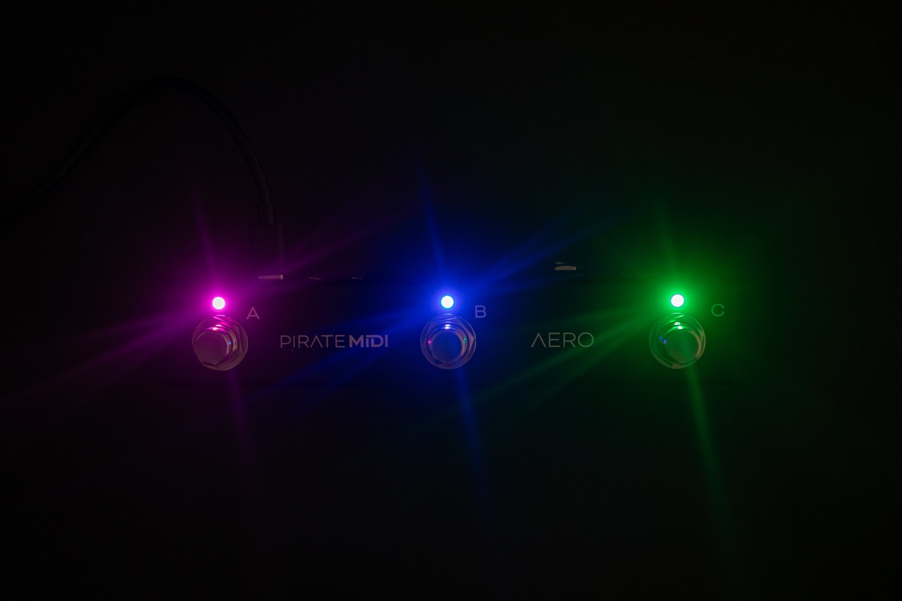

# AERO MIDI CONTROLLER
**USER MANUAL (V2.1.8)**

---

## AERO OVERVIEW
The Aero is a 3-switch passive TRS aux switch, and a MIDI foot controller with RGB LEDs, SuperSilent switches, and many exciting features. It is made in New South Wales, Australia and is built on the famous BridgeOS of our other MIDI controllers.

Without any external power, the Aero can be used as a standard aux switch for any TRS aux or footswitch jack on your amp, non-MIDI pedals, synths, and more. If you power the Aero and still only use it as an aux switch, you can use the editor to set LED colors to correspond to your aux switch functions.

The Aero can also send stacks of MIDI messages through different footswitch press types (Press, Hold, Double-Press etc.) with 128 different bank of switches to scroll through. This means that the 300+ MIDI messages on each bank can be individually assigned across the whole device for a total over more than 35,000 unique messages and controls.

To help you connect to a wide variety of music gear, we've included two Flexiports of our own design. These 3.5mm TRS jacks can be set to whatever mode best suits your setup. From expression pedals to beat sync pulse to switch emulation, you can use this MIDI controller to control devices that don't even have MIDI!

All the settings are editable using our web editor, and many of the global settings and features can be triggered remotely by sending MIDI to the Aero over USB or Device Link connection.

---

## TECHNICAL INFORMATION

* **Dimensions**: 175x50x45 mm / 6.9"x2"x1.8"
* **Weight**: 220g / 7.7 oz.
* **UI**: 3x ARGB LEDs
* **Box Contents**: 1x AERO MIDI Foot Controller, 1x USB Cable
* **Power Requirement**: 9v DC or USB (150mA)

!!! Attention
    It's important that firmware updates are installed when they are available. Old firmware may not be supported by the web editor. 
    
    Firmware updates are released frequently and offer new features, bug fixes and other improvements. User manuals are updated for each firmware update according to new features and changes.