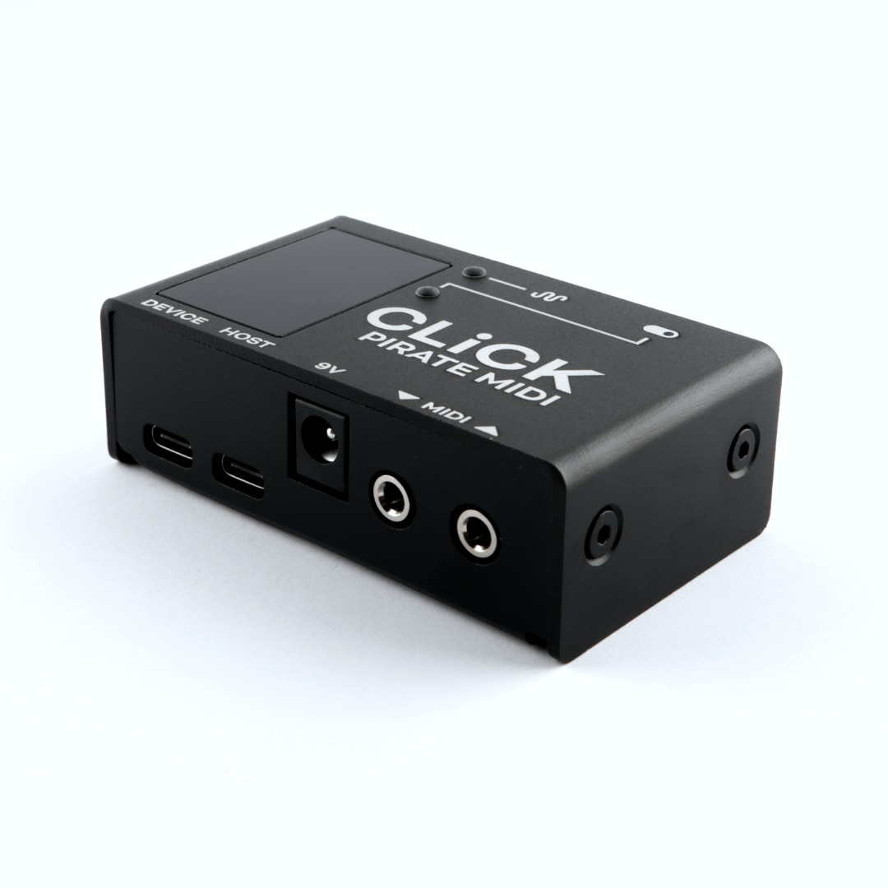
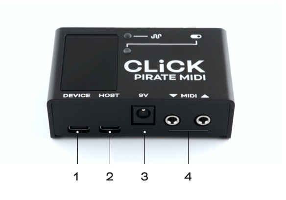
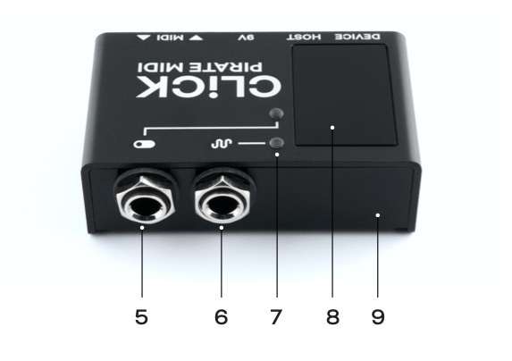

# CLICK V2
**Wireless MIDI & Utility Hub (v2.0.0)**

---

## Device Overview
The CLICK is a hub for wireless MIDI, USB MIDI host, relay switching, and emulated expression control. It is made in New South Wales, Australia and supports our Device API for external control. Now you can bring more of your non-MIDI devices into your MIDI universe.

With USB power only, the CLICK can be used as a USB MIDI and USB MIDI host interface with the built-in 3.5mm TRS MIDI jacks, a MIDI-controlled relay switcher with the 1/4" TRS relay jack, USB C jacks, and a WiFi or Bluetooth LE MIDI interface.

Each of the 128 presets can save your desired relay states for the Tip and the Ring independently as well as the position of the expression output. Please note that expression output requires a 9v DC connection and will not work on USB power only. 

!!! note
    The Expression output does not function as a CV output, but a passive variable-resistance device which emulates a normal passive expression pedal.

For even more flexibility, the MIDI out jack can be switched between MIDI Type A, MIDI Type B, or an aux switch input jack for directly controlling preset changes (up or down) without needing to send MIDI to the CLICK. The onboard utility LEDs let you select what kind of information you want to see so that no matter which features of the CLICK you're using, you get useful LED feedback.

All the settings are editable using our web editor, and many of the features can be triggered remotely by sending MIDI to the CLICK over USB or wireless MIDI.

!!! example "Firmware Updates"
    In the future, CLiCK v2 will receive firmware updates to add new features including elements of USB MIDI Host features. These features are possible on the included hardware, but the firmware does not currently support them. 

---

## Technical Information

### Dimensions
* **Metric**: 74 x 44 x 26 mm
* **Imperial**: 2.9" x 1.7" x 1"

### Weight
* **Metric**: 110g
* **Imperial**: 6.7 oz.

### UI
* 2 RGB LEDs

### Box Contents
* 1x CLiCK Wireless MIDI & Utility Hub
* 1x USB Cable

### Power Requirement
* 9V DC or USB (150mA)

### Downloads & Updates
[https://update.piratemidi.com](https://learn.piratemidi.com)
It's important that firmware updates are installed when they are available. Old firmware may not be supported by the web editor. Firmware updates are released frequently and offer new features, bug fixes and other improvements.

---

## Hardware Layout

1. **USB Device Port**: For powering the CLICK and connecting to computers to use CLICK as a USB MIDI interface.
2. **USB Host Port**: (Active from firmware v.2.0.5) Connect a single USB device and receive and send USB MIDI without needing to connect to a phone or computer.
3. **9V DC Jack**: Centre negative 2.1mm barrel jack. 150mA recommended. Required for expression emulation.
4. **3.5mm TRS MIDI**: Input and output. Output is switchable between Type A, Type B, or Aux switch input.

5. **1/4" TRS Relay Jack**: Control Tip and Ring relay states independently via MIDI.
6. **1/4" TRS Expression Jack**: Emulates a standard TRS expression pedal. Requires 9V DC.
7. **RGB LEDs**: Selectable modes to indicate relay, expression, MIDI, or wireless status.
8. **Acrylic Window**: For WiFi/BLE performance. Do not cover with metal.
9. **Enclosure**: Sturdy anodised black aluminium.

---

## 1. Device Interface

### RGB LEDs
The CLiCK has 2 RGB LEDs with multiple modes selectable in the web editor's Global Device Settings.

* **Default LED 1 (Top)**: Flashes when MIDI is received over USB, wireless, or wired MIDI.
* **Default LED 2 (Bottom)**: Shows wireless status.

#### LED Modes
* **Wireless Status (Bluetooth LE)**: Solid Red (No connection), Pulsing Blue (Connected).
* **Wireless Status (WiFi)**: Pulsing Teal (AP Mode/Setup), Pulsing Purple (Connected to network).
* **MIDI In**: Normally off, flashes purple upon receiving MIDI input.
* **Relay State**: Shows different colours based on Tip and Ring states (open/closed). 
    * Green: Tip=Open Ring=Closed
    * Purple: Tip=Closed Ring=Open
    * White: Both Closed (connected)
    * Off: Both Open (disconnected)

* **Expression**: Indicates expression position via brightness levels.

---

## 2. Power & Navigation

### Powering Your CLiCK
* **Sources**: USB cable or centre-negative 9v DC jack (2.1mm).
* **Smart Switching**: Seamlessly switch between sources without rebooting.
* **Requirement**: 9V DC is mandatory for **expression emulation** and should supply at least 150mA.

### Basic Navigation
* **Switching Presets**: Use MIDI Program Change (PC) or Control Change (CC) messages.
* **Aux In Mode**: Connect a passive TRS aux switch (like the Aero) to the 3.5mm MIDI Out jack (when set to Aux In mode) to increment or decrement presets.

---

## 3. Overview of Connectors

* **USB Device (Type-C)**: Class-compliant USB MIDI. Connect to computers, phones, or tablets.
* **USB Host (Type-C)**: Single-device USB host port. Cannot read USB hubs. Supplies USB specification power (5V, up to 500mA). Requires input power supply to match connected device's requirement.
* **9V DC**: Standard pedal power. minimum 150mA required. More if powering a USB device via USB host port.
* **1/4" TRS Relay**: Two independent silent relays (Tip and Ring) controllable via MIDI CC or presets.
* **1/4" TRS Expression**: Passive variable-resistance emulation for non-MIDI pedals.
* **3.5mm TRS MIDI**: Type A opto-isolated input. Output is switchable (Type A, Type B, or Aux In).

---

## 4. MIDI In/Out/Thru

* **Outputs**: 3.5mm TRS, USB Device, USB Host (future), and Wireless (BLE/WiFi).
* **Inputs**: 3.5mm TRS, USB Device, USB Host (future), and Wireless (BLE/WiFi).
* **MIDI Thru**: Flexible digital routing via the web editor. You can route any input to any output. Use caution to avoid infinite loops when looping back to USB or wireless hosts.

---

## 5. USB & USB MIDI
The CLiCK is a class-compliant device. It is automatically recognized by Windows, macOS, iOS, Android, and iPadOS when connected via the USB C "Device" port. 

**Note**: Mobile devices may not provide enough power; use a powered USB hub or the 9V DC jack if needed.

**USB Host vs. Device**: The "Device" port connects to a host (Computer/Phone). The "Host" port is to connect to a single USB device like a MIDI controller, MIDI keyboard, sequencer, or pedal's USB MIDI port.

### USB Host
USB MIDI devices like keyboards, synths, drum machines, MIDI controllers etc generally require a host like a tablet, phone, or computer to work with USB MIDI. The CLiCK performs this hardware role and is able to send and receive USB MIDI from such devices directly.

USB Host will allow USB MIDI messages from class-compliant USB MIDI devices to be fed into your CLiCK. Use MIDI Thru settings to choose where those incoming messages are sent to, and whether outgoing messages are sent to the USB host port. 

This includes devices that **only** have USB MIDI and no regular MIDI cable connectors (such as the Zoom Multistomp pedals, or UAFX pedals).

Only one device can be connected to the USB Host port at a time, and it will be able to supply the standard USB 5V 500mA power to your device. 

!!! note
    Please keep in mind that some devices may not be designed to be powered solely by the USB port, and will still need a power supply.

!!! warning "Requirements"
    This feature will only work with USB "Full Speed" (i.e. USB 2.0)  devices. 

    Also, some composite devices may not work. Composite devices are devices that enumerate as multiple different types of USB devices at once. For example, the device may work as an audio interface and a MIDI device at the same time. 

    If you encounter issues with a device, we may be able to investigate a fix. Please email us and let us know as much detail as possible about the situation. 

    support@piratemidi.com

---

## 6. Presets & MIDI Channel
* **Presets**: 128 available.
* **Next Preset**: MIDI CC 24.
* **Previous Preset**: MIDI CC 25.
* **Save Current State**: MIDI CC 23 (saves current relay states to the active preset).
* **MIDI Channel**: Responds to Omni (any) by default. Can be restricted to a specific channel in the web editor.

---

## 7. Expression Emulation
The CLiCK emulates a standard passive expression pedal. 
* **Requirement**: 9V DC must be connected.
* **Preset Position**: Set a starting value (0-127) in the web editor's "Preset Settings."
* **On-the-Fly**: Send **MIDI CC 11** to control the position smoothly during performance.

---

## 8. Relay Switching
Control amplifier channels, aux jacks on pedals, or mixing desks using the 1/4" TRS relay jack.
* **Independent Control**: Tip and Ring can be set specifically (On/Off) or toggled via MIDI CC.
* **Compatibility**: Emulates normally open (N.O.) or normally closed (N.C.) switches for virtually any gear.

---

## 9. Wireless MIDI

### Bluetooth Low Energy (BLE)
Default wireless mode.
* **Status**: LED2 Red (Not connected), Pulsing Blue (Connected).
* **MacOS**: Use "Audio MIDI Studio" > "Bluetooth Configuration."
* **iOS/iPadOS**: Use the "midimittr" app to bridge the connection.
* **Windows**: Download the Korg BLE driver for optimal performance.

### WiFi (RTP MIDI)
WiFi mode enables RTP MIDI (AppleMIDI) over your network.
* **Setup**: Change to WiFi mode in the web editor. The LED will pulse teal (AP Mode).
* **Configuration**: Connect to the "CLiCK Setup" WiFi network and visit `192.168.4.1` in your browser to enter your local network credentials.
* **Status**: LED2 pulses purple when connected to your network.

!!! note "Edit Saved WiFi Details"
    To change the saved WiFi details, you'll need to turn off the network of the saved details so that it fails to connect. When it fails, it will default to broadcasting its own "CLiCK Setup" WiFi network again.

---

## 10. Resetting or Updating

### Factory Reset
Clears all presets and global settings.
* **Method**: Web Editor > Help Button > Factory Reset.
* **Process**: LEDs flash; wait 20 seconds before rebooting.

### Updating Firmware
Check [www.update.piratemidi.com](https://update.piratemidi.com) for the latest firmware.
* **Online Updater**: [www.update.piratemidi.com](https://www.update.piratemidi.com)
* **Manual DFU Mode**: If an update fails, connect via USB, click "Help" in the editor, and select "Force DFU."