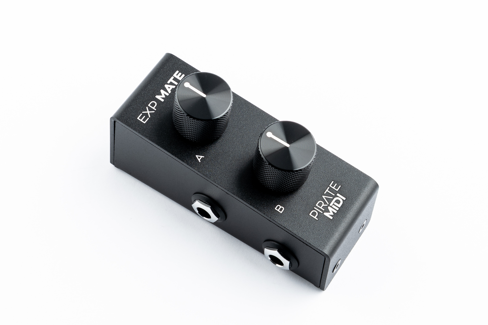
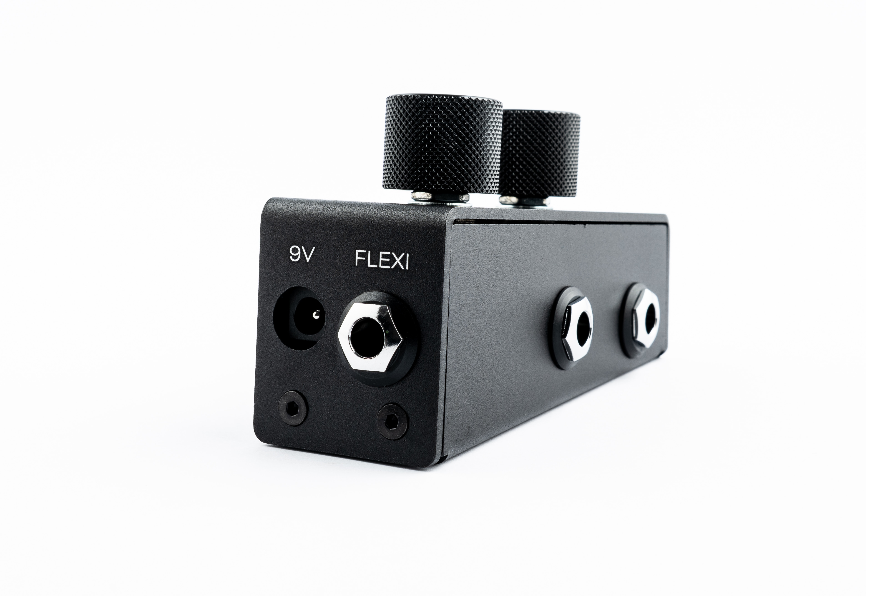
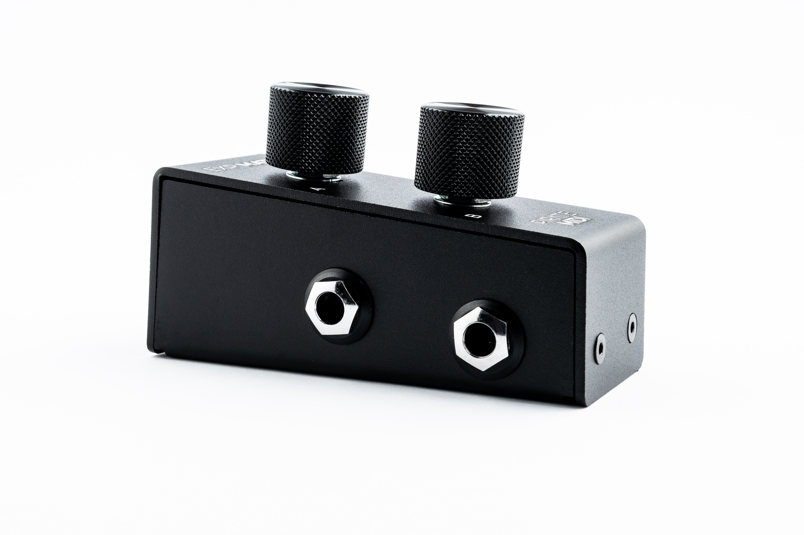

# Exp Mate User Manual

## Hardware Overview

- **Top:** 2x Marked Aluminium Knobs
- **Rear:** 1x Flexiport 1/4" TRS Jack, 1x 2.1mm centre-negative 9V DC Jack
- **Left Side:** 2x 1/4" TRS Jacks for regular (single) expression connection

- **Current Draw:** 100mA @ 9V DC
- **Potentiometers:** 10kΩ Linear

- **Dimensions:** 103mm × 36mm × 60mm
- **Weight:** 315 grams *(11oz.)*

## Introduction

The Exp Mate is like an expression pedal, but with knobs. Each expression output links directly to any regular TRS expression jack. These can be connected with a regular TRS cable to any standard expression input jack on your effects pedals, keyboards, multi-effects units, etc. This is a completely passive way to use the device and the Exp Mate can be unpowered when used like this.

Alternatively, if you supply 9V to the rear of the Exp Mate and connect the "Flexiport" jack to the Flexiport of a Pirate MIDI controller, then you can use both knobs independently on that controller with only the single TRS cable connected to the Flexiport. 

The switching between Flexiport on the rear and the two expression outputs on the left side of the device is handled automatically depending on which jacks are plugged in. 

!!! warning
    Please do not use the Exp Mate with the Flexiport connector plugged in at the same time as the expression outputs on the left side. 

## Regular Expression Mode Setup

Connect regular TRS cables from the 6.35mm (1/4") TRS jacks on the left side of the Exp Mate into the expression input jack of the device you want to control. 

Note that the wiring used is the broad standard TRS expression wiring where:

- Tip = Wiper (changing value)
- Ring = Reference Voltage
- Sleeve = Ground

## Flexiport Mode Setup

Connecting the Exp Mate to a Pirate MIDI Flexiport means that you can have independent control with both knobs, but only use a single TRS cable and only use up a single Flexiport on your controller.

Before plugging anything into the Flexiport on your Pirate MIDI device, please make sure the Flexiport is
set to the correct mode: “Exp-Doubler In” *(this is for the controller, not the Exp Mate)*

Next, plug in the TRS cable between the Flexiport and the Exp Mate's rear "Flexiport" jack. 
If needed, use a regular 3.5mm TRS to 6.35mm (1/4") TRS cable or adapter. 
For example, the Flexiports on the Aero are 3.5mm TRS and need to be adapted to the 1/4" on the Exp Mate. 

Lastly, supply power to the Exp Mate with a centre-negative 9V DC cable as found on most guitar pedal power supplies. You will need to supply at least 100mA current through your power supply.

## MIDI Messages

To learn how to assign MIDI messages to the expression pedals, please read
the Expression Messages section of the user manual for the MIDI controller you are
connecting to. The Exp Mate is a passive device and doesn't have any software or firmware. 

## Warranty

Manufacturing defects are covered by our warranty. Please contact us if your device is defective. Australian domestic customers are covered by Australian Consumer Law which requires repair or replacement for devices that do not fulfil their advertised purpose. International (Non-Australian) customers are covered by our own workmanship guarantee. We aim to create a satisfactory outcome for every single customer.

Please contact us if you have an issue with your device. Customer-caused damage may be repairable for a fee. We offer repair services for most components that receive damage.

**MADE IN AUSTRALIA**
Copyright PIRATE MIDI Australia 2026. All Rights Reserved.