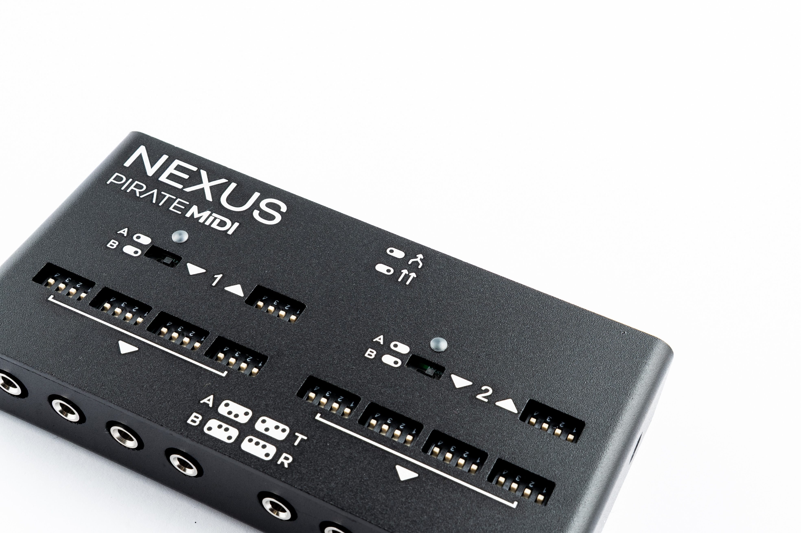
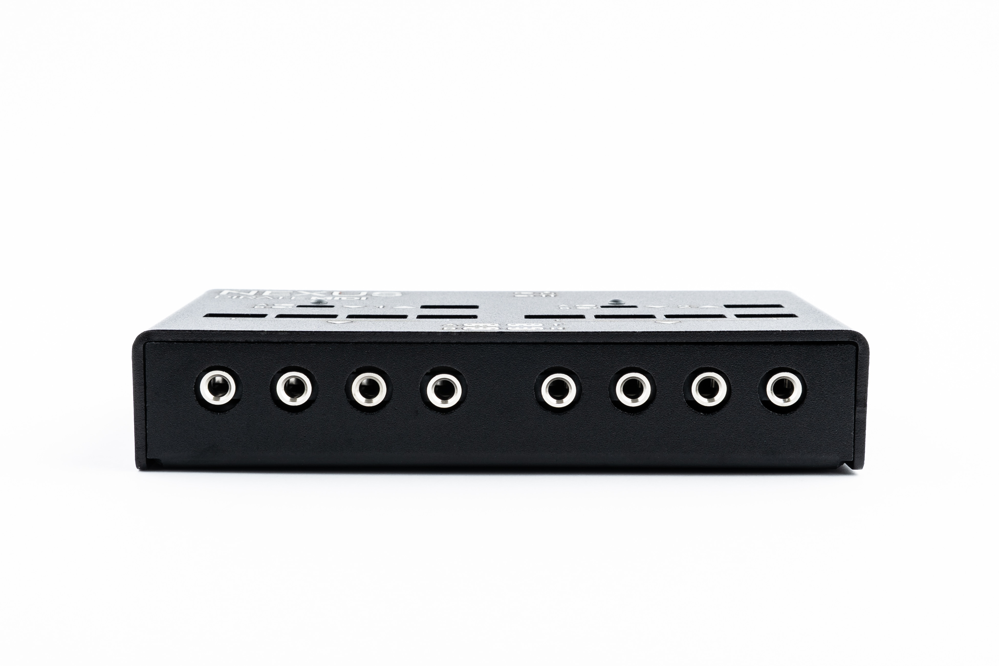
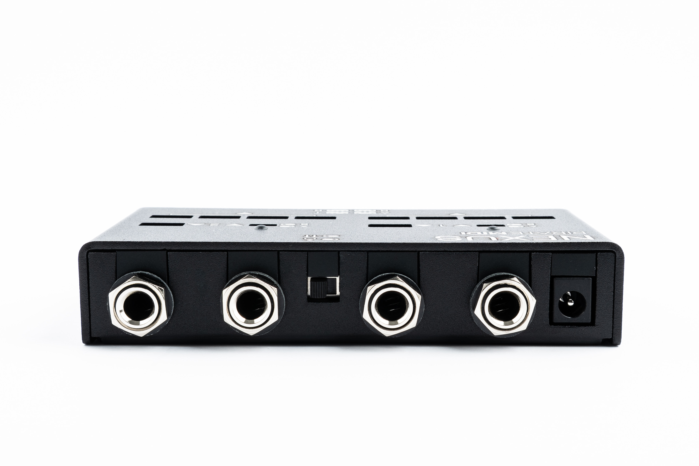
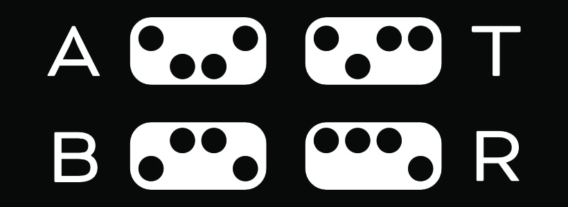
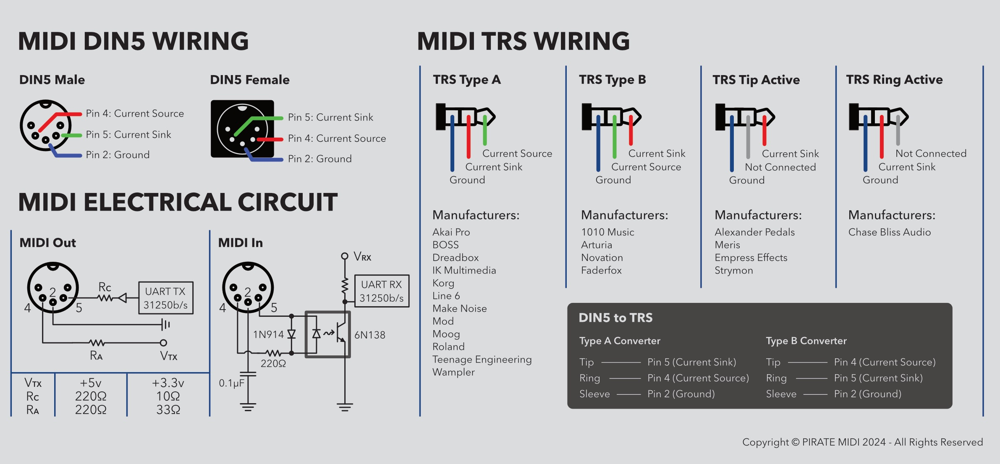

# Nexus MIDI Hub User Manual

## QuickStart Guide

**Dimensions:** 127mm x 68mm x 25mm *(5" x 2 11/16" x 1")*
**Weight:** 370 grams *(13oz.)*

**Power Requirement:** 100mA @ 9V DC *(2.1mm centre-negative barrell jack)*

!!! note
    Nexus will not work unless powered with at least 100mA 9V DC power. When working correctly, the appropriate input LED (A or B) will flash as MIDI messages are received. 

**Connectors:**
- 2x 6.35mm (1/4") TRS MIDI Input *(1 & 2)*
- 2x 6.35mm (1/4") TRS MIDI Output *(1 & 2)*
- 8x 3.5mm (1/8") TRS MIDI Output *(4x Side 1 & 4x Side 2)*

**Switches:**
- 1x Merge switch (in between 6.35mm (1/4") jacks)
- 2x MIDI Input Type A/B switches (inline with TRS 6.35mm (1/4") input jacks)
- 10x MIDI Output 4-way dipswitches (inline with each output jack)

**LEDs:**
- 2x Input LEDs which flash when MIDI messages are detected coming into the Nexus

### Connecting Your Gear

1. Plug the Nexus into 9V DC power with at least 100mA current available from the power supply.

2. Check the TRS MIDI type for the devices you're connecting and use the legend below (also printed on the device) to check the dipswitches are in the correct position

    - **Type A:**       MIDI Org Standard (BOSS, Elektron, PIRATE MIDI)
    - **Type B:**       Novation, Arturia, Polyend
    - **Tip Active:**   Alexander, Meris, Empress, Strymon, Bondi
    - **Ring Active:**  Chase Bliss Audio

3. Connect output of your MIDI controller/source to the input/s of the Nexus

4. Connect the correctly-set output/s of the Nexus to the MIDI input jack/s of your target devices

5. Set the Merge switch to split sides A & B or to merge the MIDI together and send all inputs to all outputs. 

6. Play! 

## Merging
The Nexus is a passive MIDI merger. It doesn't have any software checking each message. This means that if the MIDI inputs are both saturated, and the merge switch is set to merge, there is a possibility of lost or corupted MIDI messages to the outputs of the device. This is only likely when saturating the inputs with MIDI clock from two sources, or heavy epxression or LFO activity. This is unlikely, but should be noted as a limitation of any device that doesn't use a software merge to check each message is sent to the outputs correctly. In nearly all normal use cases, this will not be an issue. 

Splitting the inputs means that the Side 1 input will be sent to all 5 Side 1 outputs, and the Side 2 input will be sent to all 5 Side 2 outputs. 

## Dipswitches and Setting TRS Type
The dipswitches are recessed to avoid any accidental switching. To switch them you can use a small screwdriver, or the tip of a pen. Avoid using a sharp metal object like a knife, and do not force the switches. They are firm, but if they are stuck, please contact us at [support@piratemidi.com](mailto:support@piratemidi.com)

The Inputs are only switchable between TRS Type A and Type B. This is because the Tip Active and Ring Active connections are only applicable to inputs on pedals, and therefore only applicable to outputs on the Nexus. 

## Activity LEDs
When MIDI message activity is detected on the Side 1 and Side 2 input jack, and the device is powered, the input LEDs will flash on and off rapidly for each message that is detected. If a message is detected on Side 1, the Side 1 LED will flash. If 
Side 2, then Side 2 will flash. 

As mentioned earlier, this is not a software feature, but an electrical feature. So this LED cannot indicate anythig about the message, and whether it's settings are correct for your device. 

## TRS to DIN5
If you need to use your Nexus with a DIN5 device, you will generally be using a Type A cable or adapter. However, just in case of any abormalities or questions, we've included all TRS and DIN5 wiring diagrams below.

!!! note
    All adapters and cables sold by PIRATE MIDI are wired for Type A, normal MIDI connections, unless otherwise specified. All TRS cables are regular TRS cables with straight-through wiring (tip>tip etc.)

## MIDI Channels
Please be aware that for a device to hear a MIDI message that it receives, not only must the TRS MIDI type be set correctly, but also the MIDI channel of the incoming message must match the MIDI channel that the device is set to. So, the target pedal or synth must be set to the same MIDI channel as the message that you're sending to it.

Without a matching MIDI channel, your pedal, synth, etc. will ignore the incoming MIDI message. 

## Warranty

Manufacturing defects are covered by our warranty. Please contact us if your device is defective. Australian domestic customers are covered by Australian Consumer Law which requires repair or replacement for devices that do not fulfil their advertised purpose. International (Non-Australian) customers are covered by our own workmanship guarantee. We aim to create a satisfactory outcome for every single customer.

Please contact us if you have an issue with your device. Customer-caused damage may be repairable for a fee. We offer repair services for most components that receive damage.

**MADE IN AUSTRALIA**
Copyright PIRATE MIDI Australia 2026. All Rights Reserved.

