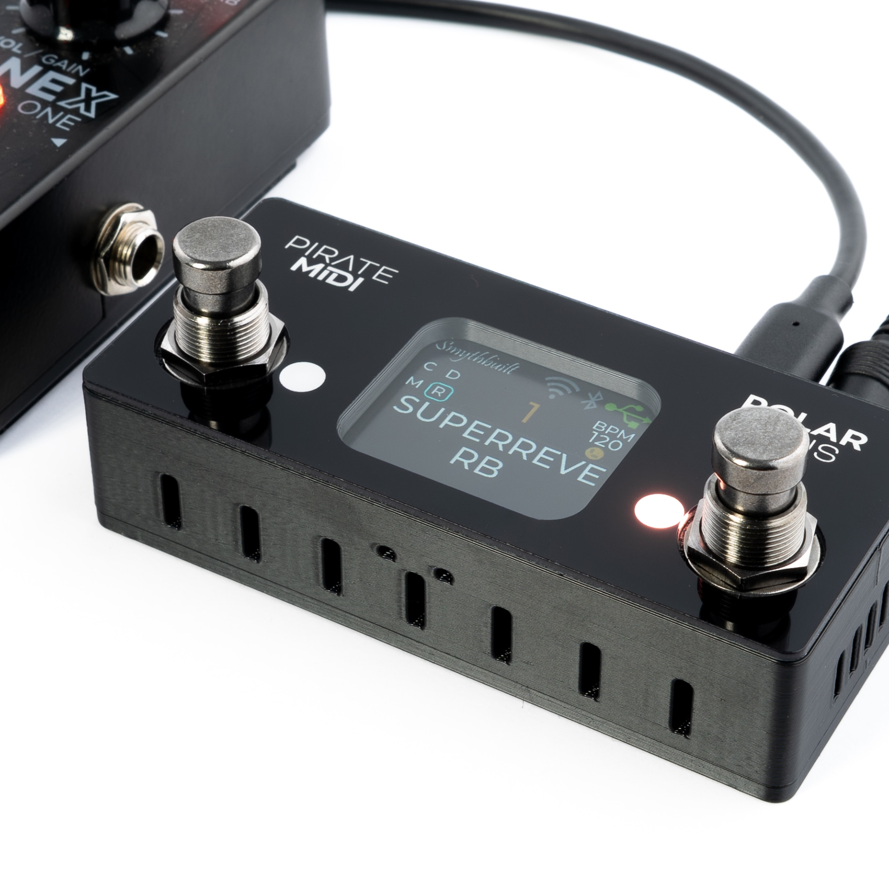
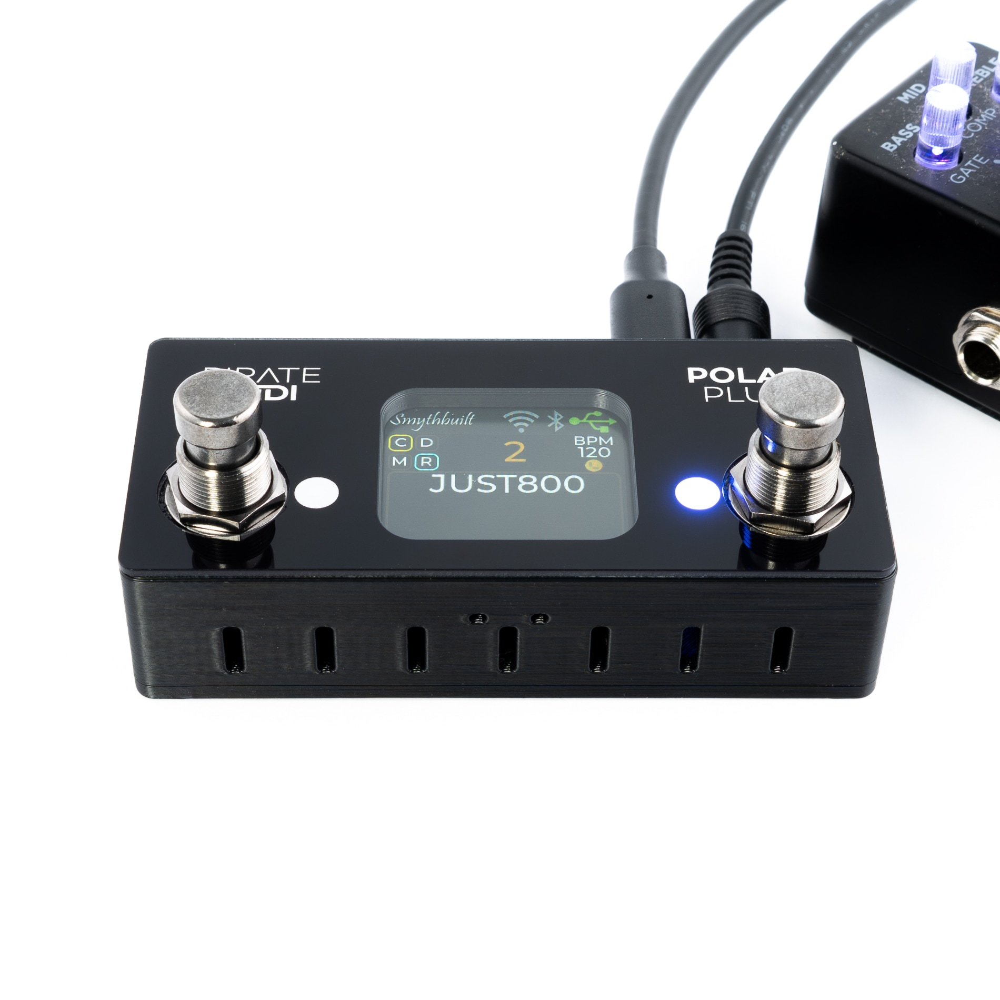

# POLAR PICO
**Wireless ToneX One MIDI Controller**

---
## ToneX, ToneX One, and GP-5 MIDI Control
Take full control of your ToneX, ToneX One, or GP-5 pedal with MIDI—no complicated setup required. Just connect your pedal's USB to this small, powerful box using USB-C, and you’re ready to go. It powers the pedal and sends MIDI messages to switch presets, tweak settings, and more. Truly plug and play.

## How It Works
Each unit features an ESP32 wireless module, a custom 9V center-negative power circuit, USB-C for connecting the pedal, a 3.5mm TRS (Type A) MIDI input, and a 3.5mm TRS (Type A) MIDI Thru. You can also control your pedal wirelessly via Bluetooth or WiFi using a compatible MIDI controller or app.

## Polar Pico, Mini, Plus, and Max
Our Polar controllers come in four sizes—Pico, Mini, Plus, and Max. All four models offer the same core features and connections, including USB, wired MIDI input, and wireless MIDI. The difference lies in the user interface options, so you can choose the layout that best fits your rig. See the table below for a side-by-side comparison.

Our version 2 hardware - released in January 2026 - makes these devices even more space efficient and adds our brand new optical switching technology to models with footswitches. This means almost endless life for your footswitches with no mechanical switches to wear out. 

Version 2 hardware also adds RGB to some Polar models for a better experience changing effects, changing presets, and adjusting other settings too.

--- 

### Contacting Support
For functional enquiries like software problems, questions about features or ideas for changes, you can join our [Discord server](https://discord.gg/x722K7ksA6), or contribute to the [discussions page of the Github repository](https://github.com/Builty/TonexOneController/discussions) for the open source project.

For all support enquiries regarding the physical hardware, damage, repair, or returns please contact Pirate MIDI. Extra overview content for this project can be found on [Greg's YouTube channel here](https://www.youtube.com/@gregsmith1526).