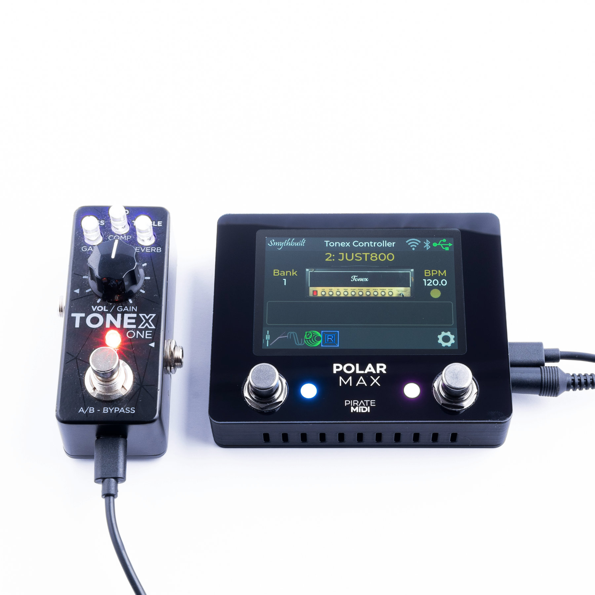

# POLAR PLUS
**Wireless ToneX One MIDI Controller**

## Introduction
Thanks for purchasing a Polar Max! This smart little box is designed to connect a ToneX One into a MIDI control system - whether that's using an app on your phone, a foot controller, a DAW, or a keyboard. Based on the ESP32 hardware platform, and using the open source firmware and software built by Greg Smith (Builty), the Polar series allows you to switch presets, toggle effects, change parameters, and more - all with MIDI control.

This is enabled by translating incoming MIDI commands into the USB serial messages that the ToneX One and GP-5 are expecting. 

!!! example "Experimental"
    This is considered a "hack" and not something that IK Multimedia or Valeton will provide customer support for.

## Video Resources

### Firmware Update

<iframe width="560" height="315" src="https://www.youtube.com/embed/ygJXO1M7p0s?si=IRN7i3tKqwvd-YdZ" title="YouTube video player" frameborder="0" allow="accelerometer; autoplay; clipboard-write; encrypted-media; gyroscope; picture-in-picture; web-share" referrerpolicy="strict-origin-when-cross-origin" allowfullscreen></iframe>

### v1 Polar Max build guide

<iframe width="560" height="315" src="https://www.youtube.com/embed/EYmiK8_B6EI?si=NyedLurkzHju1tuz" title="YouTube video player" frameborder="0" allow="accelerometer; autoplay; clipboard-write; encrypted-media; gyroscope; picture-in-picture; web-share" referrerpolicy="strict-origin-when-cross-origin" allowfullscreen></iframe>

### MIDI Control Guide

<iframe width="560" height="315" src="https://www.youtube.com/embed/g_w_sGxK-ZI?si=07Se_CRMKEYXdutD" title="YouTube video player" frameborder="0" allow="accelerometer; autoplay; clipboard-write; encrypted-media; gyroscope; picture-in-picture; web-share" referrerpolicy="strict-origin-when-cross-origin" allowfullscreen></iframe>

### Contacting Support
For functional enquiries like software problems, questions about features or ideas for changes, you can join our [Discord server](https://discord.gg/x722K7ksA6), or contribute to the [discussions page of the Github repository](https://github.com/Builty/TonexOneController/discussions) for the open source project.

For all support enquiries regarding the physical hardware, damage, repair, or returns please contact Pirate MIDI. Extra overview content for this project can be found on [Greg's YouTube channel here](https://www.youtube.com/@gregsmith1526).