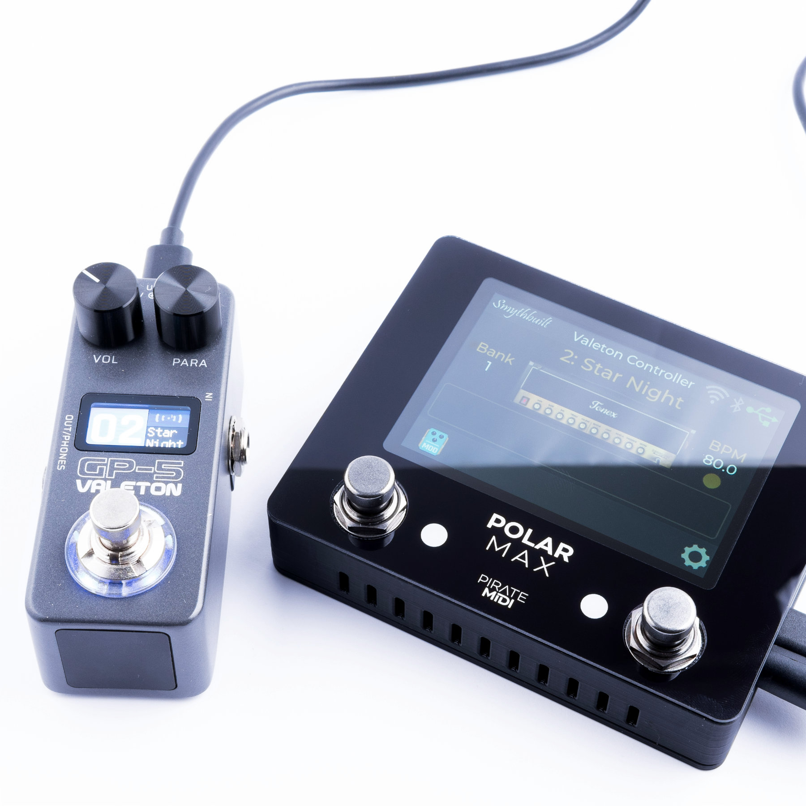
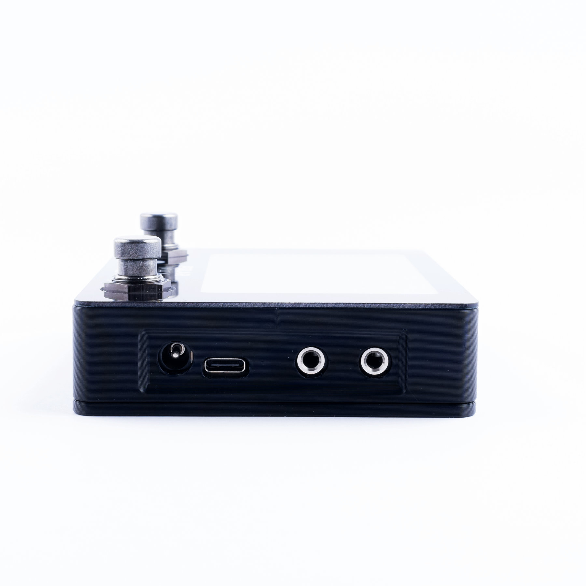

## 1. Quickstart

### Hardware Overview
* **Enclosure**: Can be opened over and over with metal threaded inserts and hex screws.

* **3.5" Screen**: Sharp and high quality LCD touch screen.

* **RGB LEDs**: One RGB LED per footswitch for signalling switch and effects states.

* **Footswitches**: Two gun-metal optical footswitches for instant switch activation and near limitless lifespan.

* **Cooling/Buttons**: Vent holes for cooling as well as convenient access to reset and bootloader buttons.

* **Button Orientation**: With switch holes (left side of the Polar Max) pointing towards you, **Bootloader=Right & Reset=Left**.

* **Power**: 9V DC 2.1mm centre negative barrel jack for power.

* **USB Type C**: Connect your ToneX One or GP-5 pedal to this jack and it will receive full power as well as communication for changing presets and parameters.

* **MIDI Input**: 3.5mm TRS Type A MIDI input (port closest to the front edge). Can be adapted to DIN5 or 6.35mm, or other TRS Type with adapters. Complies with MIDI.org specification.

* **MIDI Output**: 3.5mm TRS Type A MIDI Output (furthest from the front edge). Dedicated "thru" jack which replicated all incoming MIDI and sends it to this output to remove the need for MIDI hubs or splitters when using the Polar Pico in a larger MIDI system.

### What You Need
* **USB Type C cable**: The cable that comes with the ToneX One is perfect for this.

* **9V DC power**: Pedalboard power supplies are suitable. Needs at least 600mA.

* **MIDI controller**: This can be an app, a DAW, a MIDI controller pedal or desktop device - anything that can send MIDI messages.

* **Computer or Phone**: Use the browser and WiFi settings on your computer or phone to access the configuration web page for the Polar controllers.

### First Time Setup
The device is pre-configured to work as soon as you power it up with all the hardware features activated. Simply plug in the ToneX One pedal, plug a MIDI device into the 3.5mm TRS jack, and you can select presets using Program Change (PC) messages, or change parameters, scroll presets, and toggle effects using the MIDI messages listed on the [MIDI Commands page](../polar-pico/pico-midi-commands.md).