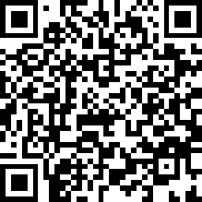
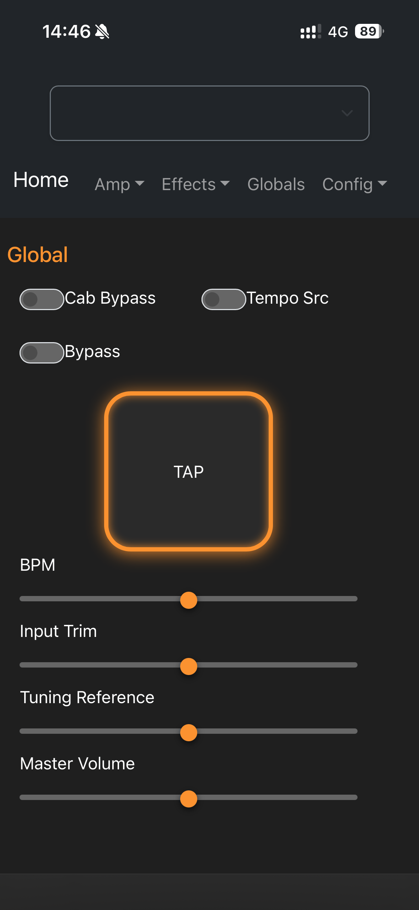
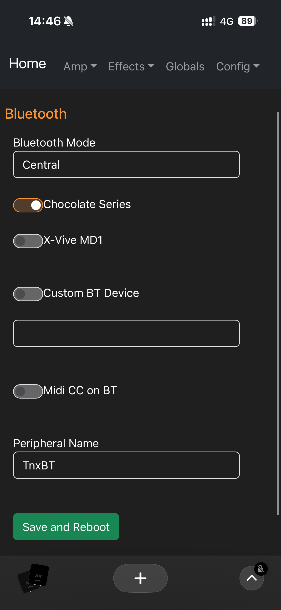
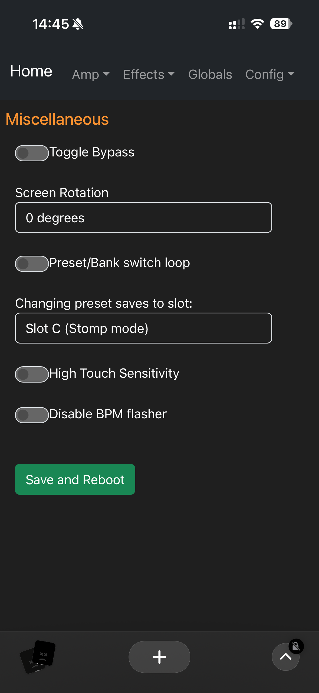

## 2. Web Configuration

## Connecting to Web Configuration
For the first time, you need to connect to the controller in Access Point (AP) mode. Once this has been done, the WiFi mode can be changed if desired. If you use Station Mode, please first make sure your router has mDNS/Bonjour enabled, and that you enter "http" and not "https" when loading tonex.local.

**Follow these steps:**
1.  Reboot the controller.
2.  Within 60 seconds, use a phone or PC to connect to the WiFi device **TonexConfig**.
3.  Enter the password for the network: **12345678**.
4.  The controller will automatically supply a network address for your device (DHCP is supported).
    
!!! tip 
    Some phones may attempt to use this network for Internet access, which will not be available. Watch out for any messages asking you to confirm the connection.

5.  Open a web browser on your phone, tablet, or computer.
6.  In the address bar of the web browser, enter [http://tonex.local](http://tonex.local). This should load the web config screen.
7.  Once you have saved the settings (or if you don't want to change anything) you can close the web browser. The settings will be already changed on the Polar controller.

### QR Code Connection
You can also connect to the controller by scanning the below QR code using your phone camera or QR scanning app:

### Settings Changed by Web Configuration
The following settings can be found on the web configuration page. More detailed descriptions for each setting can be found on the [GitHub page](https://github.com/Builty/TonexOneController/blob/main/WebConfiguration.md).

* **Gate/Noise Gate**: Enable, Post, Threshold, Release, Depth.
* **Preset Management**: Select & Name Presets.
* **Effects**: Change & Save Effects Parameters.
* **Bluetooth**: Mode, Device Type, Custom BT Device Name.
* **MIDI**: Change MIDI Channel, Deactivate Wired MIDI Input.
* **Misc**: Disable Preset Reset if Same Preset Is Sent Multiple Times.
* **External Switches**: Change Settings for External Switches (would require extra modification. See GitHub repo for more details).
* **WiFi**: Change WiFi Mode, WiFi Power, Network Name (SSID), and Password.
* **System**: Save and Reboot Polar to Activate New Settings.

---

## 3. Bluetooth

### Bluetooth Settings
The "BT" category on the left menu of the Web Configuration page allows viewing and changing of the Bluetooth options.

### Bluetooth Mode
* **Disabled**: Bluetooth is totally disabled and non-functional.
* **Central (default)**: Allows the controller to locate and connect to other peripherals, like the M-Vave Chocolate.
* **Peripheral**: Allows the controller to be discovered and connected to by other Central devices (like a Phone or a PC).

### Device Enable Toggles
* **Chocolate Series**: Enable support for the M-Vave Chocolate and Chocolate Plus Bluetooth footswitch controllers (default: on).
* **X-Vive MD1**: Enable support for the X-Vive MD1 MIDI bridge device (default: on).
* **Custom BT Device**: Enable support for some other Bluetooth MIDI peripheral. Enter its device name, and check the checkbox to enable it (default: off).

### Bluetooth MIDI CC
This toggle enables support for Control Change (CC) commands over Bluetooth. These can control effects parameters and other device settings remotely using MIDI apps or controllers.
* This toggle is **disabled by default**, because the M-Vave Chocolate pedal, when changing banks, sends a conflicting change that modifies the ToneX parameters.
* This setting should not be enabled with a Chocolate controller that has the default configuration loaded.

---

## 4. Miscellaneous Settings

### Preset Twice Toggle (Toggle Bypass)
* **Disabled (default)**: Setting the same preset index multiple times will not have any effect.
* **Enabled**: Setting the same preset a second time will set the ToneX pedal to bypass mode. Setting it a third time will exit bypass mode. This setting is most suited to use with pedal models.

### Preset/Bank Switch Loop
This setting controls whether incrementing the preset from the last preset will "loop" back around to the first preset or not. It also affects decrementing from the first preset to the last or not.

### High Touch Sensitivity
For models with a touch screen, the acrylic overlay can decrease the responsiveness of the touch interface. Turning this toggle on will increase the sensitivity to return performance to normal with the acrylic protector in place. 

### Disable BPM Flash
This setting does what it says. If you don't like the flash of the tempo on the main screen, turn this toggle on to stop the flashing.

!!! success "Save and Reboot"
    The Save and Reboot buttons on each configuration page will save all settings and reboot the controller to take effect.

---

## 5. Contributing to the Project

* **Via Purchase**: Your purchase has already funded the open source project. 10% of all Polar controller revenue is sent to Greg Smith as a thank you for creating and maintaining the software and firmware.
* **Via Discussion**: Lodge an issue or discuss feature ideas on the [GitHub repo](https://github.com/Builty/TonexOneController).
* **Via Code**: You can fork the repo, submit pull requests, and contribute yourself.
* **Via Word of Mouth**: Spread the word! More customers mean more potential contributors and faster feature additions.