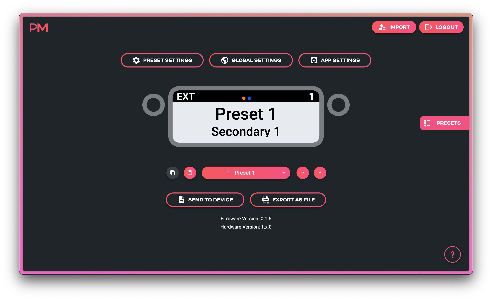
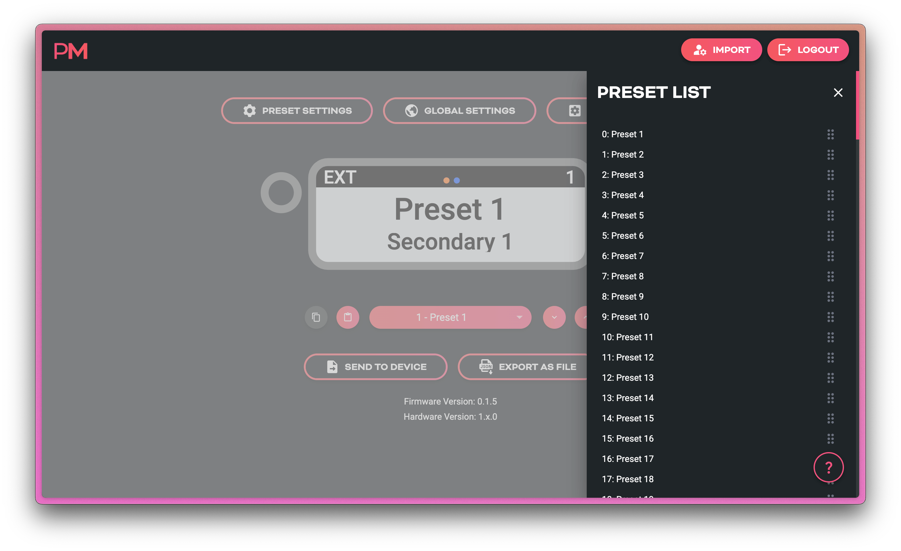
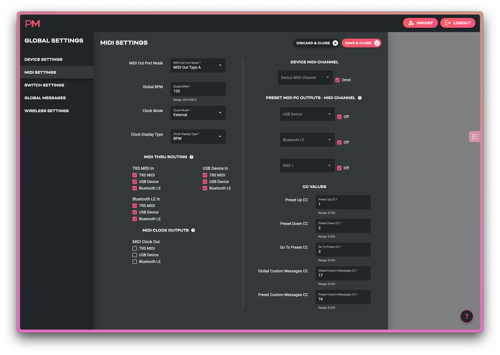

# Scribble Quickstart Guide
_A compact, configurable LCD display for showing custom preset names and other text, sending custom MIDI messages, and scrolling presets in your MIDI rig._

{.imageheight-300}

---

## What is Scribble?
**Scribble** is a standalone, USB-powered display module which can send and be controlled by MIDI messages. 

  <iframe 
    src="https://www.youtube.com/embed/XvlBdcOCHBI?si=MGOOK0JFtBc-qJ75"
    title="YouTube video player"
    frameborder="0"
    allow="accelerometer; autoplay; clipboard-write; encrypted-media; gyroscope; picture-in-picture; web-share"
    referrerpolicy="strict-origin-when-cross-origin"
    allowfullscreen
    style="position: absolute; top:0; left:0; width:100%; height:100%;"
  ></iframe>

It shows **text labels**, **preset numbers**, **MIDI clock data**, and **connection status** received over MIDI or inherent in the device itself. 

- Onboard buttons can be used to send preset change commands, or any other set of custom MIDI messages you wish to send. 

- MIDI clock can be received and passed on thru the Scribble, or Scribble can generate its own MIDI clock to send to your MIDI devices. 

- Stacks of custom MIDI messages (up to 8 messages per stack) can be triggered by sending default or user-assigned MIDI CC's to the Scribble from an external MIDI device or app. 

- All configuration happens in the [**Pirate MIDI Web Editor**](https://edit.piratemidi.com) — nothing is configured directly on the hardware.

### Key Features
- USB MIDI + 3.5mm TRS MIDI Type A/B *(Switchable in editor)*
- 1.47" LCD display 
- 128 Customisable presets with text, colours, and MIDI messages
- Real-time MIDI clock display  
- Preset switching via CC or PC 
- USB-powered or 9V DC powered
- Web-based configuration *(Chromium browser required)*
- Firmware updates via browser at [**update.piratemidi.com**](https://update.piratemidi.com)

---

### What’s In The Box
- Scribble unit  
- Protective screen overlay
- Adhesive strip
- 3.5 x 1.1mm to 5.5 x 2.1mm DC centre negative right angle adapter cable

### Hardware Guide

---

## Quick Setup (60-Second Version)

### 1. Power the Scribble
Connect to any 5V USB-C or 9V DC power source.  
On first power-up, a welcome process will start and prompt for any new firmware updates. After first power-up, this screen will not show again.

### 2. Open the Web Editor
Go to:  
[**https://edit.piratemidi.com**](https://edit.piratemidi.com)

!!! info "Browser Support"
    Use Chrome or another Chromium browser. Non-Chromium browsers do not support webMIDI or webSerial and will not recognise your device.

Select **Import from Device**, then choose the device with  
`Scribble` in the name, and click **connect**

### 3. Edit a Preset
On the main screen, you can start editing your presets by clicking on the text entries and simply replacing it with your own. 
To change what messages the buttons send, click on one of the buttons' representations on the screen. To change the function of the buttons, go to **Global Settings**.

On the main screen you can:

- View and edit text labels  
- View global or per-preset colour settings visually   
- Scroll through presets
- Copy and Paste whole presets for efficient workflows 
- Use keyboard shortcuts `J` and `K` to change presets

### 4. Upload to Device
Click **Send to Device**. Select the Scribble from the pop-up and press `Connect`
The Scribble updates instantly — no reboot needed.

## Using the Web Editor

### Import Screen Overview
- **Import from Device** — connect your device by USB and import all its configuration
- **Import from File** — use a Pirate MIDI .json config file to load a configuration (backups, alternate configs etc.)  
- **Create from Template** — use pre-made configs including blank, factory default, and brand or device starting templates from Pirate MIDI 

---

### Main Screen Overview
Each preset on the device and the editor primarily contains **these elements**:

| Element | Purpose |
|--------|---------|
| **Primary Text Label** | 12-Character Text Field |
| **Secondary Text Label** | 16-Character Text Field |
| **Preset Number** | Shows Scribble's Current Preset |
| **MIDI Clock** | Shows Incoming or Generated MIDI Clock in BPM, ms, or with Flasher |
| **Status Indicators** | Shows Incoming MIDI and BLE Status (static in web editor) |
| **Background Colour** | Configured Globally or Per Preset |
| **Text Colour** | Configured Globally or Per Preset |
| **Status Bar Colour** | Light or Dark Mode Selected Globally |

You can see these elements all displayed on the editor screenshot below

On top of these obvious parameters, there are also MIDI messages, MIDI clock, and other settings that can change how you use your Scribble.

Below the main visualisation of the Scribble, you'll also see a number of buttons near the bottom of the screen. These buttons are for navigating, copying, and pasting full presets.

### Reordering Presets
Sometimes presets need to be swapped around. To access the drag-and-drop preset reordering menu, just click on the presets list icon on the far right hand side of the editor's main screen. Image shown below.

### Sending Your Config To The Scribble
**Send to Device** is the button to send the modified config to the Scribble. No changes are synced until you press this button and transfer the settings - even if you first imported from the device and left the device connected with USB. 

### Saving or Backing Up Multiple Configs
Backing up your configuration is an important part of working with technology. You may also use your Scribble in different contexts and need to switch whole configurations at a moment's notice. If this is the case, you can save your configurations to your computer using the **Export as File** button.

A `.JSON` file will be saved to your computer. These files can be edited without the web editor as well (if you have the inclination!).

## Preset Settings Page
Here you will find a set of submenus which let you set colours, modes, and MIDI messages that will apply **only to the current preset**. To apply the changes to a specific preset, select that preset from the main screen before entering the **Preset Settings** page. 

!!! tip
    The Preset Settings page contains copy and paste buttons in the left side menu. These will copy the settings of the entire preset and you can paste them to other presets. 

| Submenu | What's Inside |
|--------|---------|
| **Preset Settings** | Text Fields, Colours, Tempo |
| **Switch Messages** | Add MIDI Messages To Each Switch |
| **Preset Messages** | Add Other Custom MIDI Messages |

#### Preset Switch Messages
Each Switch (Left and Right) has two possible actions: `Press` and `Hold`. So with just two buttons you can send 4 different sets of MIDI messages from your Scribble. 

These messages are customised per preset. If you want a switch to send the same message regardless of the current preset, use **Global Switch Messages**

#### Preset Message
Preset Messages are sent when you enter the selected preset on the Scribble. For example, if CC 8, value 12 is in this messages stack on Preset 12, then every time the Scribble is changed from a different preset to Preset 12 (whether internall or externally), CC 8, value 12 will be sent automatically.

#### Preset Custom Trigger Messages
Preset Custom Trigger Messages are only activated when the default or user-assigned MIDI CC message is received by the Scribble. The default CC for Preset Custom Trigger Messages is `16`.

## Global Settings Page
Here you will find a set of submenus which let you configure MIDI channel, MIDI outputs, MIDI Thru routing, custom global messages, and more. MIDI Messages added to a *global* message stack will not be restricted to a single preset, but available at all times in all presets.

| Submenu | What's Inside |
|--------|---------|
| **Device Settings** | USB Display Name, Light/Dark Mode, Display Brightness, Colours |
| **MIDI Settings** | TRS MIDI Type, Clock Mode, Ext CC, MIDI Channel, Thru Routing |
| **Switch Settings** | Switch Modes, Global Switch Messages |
| **Global Messages** | Global Custom Trigger MIDI Messages |
| **Wireless Settings** | Wireless Mode, BLE Mode |

### Device Settings
This page lets you change some fundamental global settings of the device. 

- **Device Name:** Used to show USB name on computers. Helps to distinguish between devices when you have multiple Scribbles.
- **Main Colour:** Global background colour (used unless overridden per preset)
- **Text Colour:** Global text colour (used unless overridden per preset)
- **Light/Dark Mode:** Changes the status bar colour between **Black** or **White**. This is a global-only setting. 
- **Display Brightness:** Adjust the screen's brightness to adapt to different environments.

### MIDI Settings

**MIDI Out Port Mode:** 
Change the 3.5mm TRS MIDI Out port between `Type A` & `Type B` TRS MIDI. This type of MIDI can be adapter to 1/4" TRS MIDI or DIN5 MIDI with a simple adapter cable. 

- Chase Bliss Audio pedals will use `Type B`
- Alexander, Meris, Jackson Audio, Boss, and Empress will use `Type A`

!!! warning "Older Chase Bliss Audio Pedals"
    Some original Chase Bliss Audio pedals with MIDI require the Tip of the TRS cable to be completely disconnected, and the Scribble cannot do that. You will need to phyiscally modify any TRS cable you're using to disconnect the Tip if you want to use them. 
    *(You will also need to set the MIDI out to Type B, of course.)*

**Global BPM:** Set the tempo of the Scribble's own MIDI clock generator. Global BPM will apply to all presets unless the **Clock Mode** is set to `Preset`.

**Clock Mode:** 

- **`Preset`**: The MIDI clock will set its tempo according to the "BPM" setting in the Preset Settings. This allows different pre-assigned tempos per preset. 
- **`External`**: The MIDI clock will not be generated by the Scribble. If Scribble detects MIDI clock coming into the device, the tempo will display on the Scribble's screen along with an **Orange** or **Green** font colour. 
    - **Orange** means a `MIDI Start` command has not been received. 
    - **Green** means a `MIDI Start` command has been received. 
    - If a `MIDI Stop` commands is received, the text colour will revert to **Orange**
- **`Global`**: The MIDI clock will be the same on every preset. Determined by the **Global BPM** setting above.
- **`None`**: MIDI clock is entirely disabled.

**Clock Display Type**: This lets you change the BPM readout on the Scribble between a BPM number, milliseconds number, or a flashing indicator only. 

**MIDI Thru Routing**: When MIDI comes into the Scribble via any of the three inputs (TRS, USB, BLE), you can choose whether that MIDI is automatically duplicated to any of the other outputs, or whether it ends its journey inside the Scribble.

This doesn't affect any MIDI messages that Scribble itself generates and sends.

**Clock Outputs**: MIDI clock messages can be limited to only send to selected MIDI outputs instead of all three. 

**Device MIDI Channel**: Set a MIDI channel for your Scribble. This is highly recommended, and will be necessary to use when you are using the external MIDI control CC messages to change presets, trigger custom MIDI messages, etc.

**Preset MIDI PC Outputs**: This feature allows you to select a MIDI channel for each of the MIDI outputs (TRS, USB, BLE) and turn on an automatic Program Change (PC) message that will be sent when the Scribble changes presets.

This is an easy way to keep your pedal in sync with Scribble. Say you've connected a Chase Bliss Audio pedal whose channel is set to 2 (CBA's default). Simply connect your Scribble to your pedal, turn on the TRS **PC Output** to channel 2, and when you use the onboard buttons to change presets on the Scribble, the Chase Bliss Audio pedal will follow along. 

**CC Values**: These fields contain the factory default MIDI CCs for externally controlling the Scribble. However, if you prefer, you can set custom CC numbers instead.

### Global Switch Settings

**Switch Modes**: These modes change how each of the buttons work. You can limit Scribble preset changes only to certain switch actions, or remove them entirely.

- `Press Preset Down`
- `Press Preset Up`
- `Hold Preset Down`
- `Hold Preset Up`
- `MIDI Only` Send only your custom MIDI messages

**Press/Hold Messages**: Just like preset-level switch messages, you can add custom MIDI messages that are sent on a `Press` or a `Hold` action. These will activate on every single preset, and they will be sent **in addition** to the preset-level switch messages. 

### Global Messages

**Global Custom Trigger Messages**: Just like preset-level custom trigger messages, these messages will only be sent when the default or user-assigned CC number is sent to the Scribble from an external MIDI source. The difference is that these MIDI messages will trigger the same regardless of which preset the Scribble is currently on. 

The default CC for the Global Custom Trigger Messages is `17`.

### Wireless Settings

**Wireless Type**: Use this to turn off the BLE system entirely if you prefer. 

**BLE Mode**: `Server` mode is the default, and `Client` is currently experimental and may not work properly. A future firmware update will expand this function. 

`Server` mode is the standard mode for devices, as opposed to computers, phones, etc. 

!!! tip
    If you're using a CME WIDI device, set it to `Central` mode to connect to a Scribble. `Peripheral` mode on CME's products is the same as `Server`. 

## App Settings Page
Here you will find web-editor specific tools. Currently this includes MIDI Channel Aliases. 

Add the names of your devices to their respective MIDI channel section, and the name of that device will show across the entire web editor anywhere you need to choose a MIDI channel. Then, instead of a list of MIDI channel numbers, you'll see a list of your devices. This makes it a lot easier to quickly choose which device you're sending a MIDI messages to! 

---

## Connecting Scribble to Your Gear

### USB MIDI
Scribble is a USB device (not a host) and when using USB for MIDI communication you can connect directly to:

- Computers
- Tablets
- Phones
- Other USB Host Devices
- MIDI Controllers With Host Ports
- Kemper Profiler Player's USB Host Port 

### TRS MIDI (Type A/B Switchable)
Compatible with:

- Strymon (Type A) 
- Chase Bliss Audio (Type B)
- Boss (Type A)
- Meris (Type A)
- Jackson Audio (Type A)
- And standard TRS MIDI pedals

!!! warning "Older Chase Bliss Audio Pedals"
    Some original Chase Bliss Audio pedals with MIDI require the Tip of the TRS cable to be completely disconnected, and the Scribble cannot do that. You will need to phyiscally modify any TRS cable you're using to disconnect the Tip if you want to use them. 
    *(You will also need to set the MIDI out to Type B, of course.)*

### BLE MIDI
Bluetooth Low Energy (BLE) MIDI can be used with WIDI by CME, M-Vave Chocolate, and other BLE MIDI devices to wirelessly send MIDI to your Scribble to control it. 
Tablets, phones, and computers can also connect and send MIDI. Apps like TouchOSC, DAWs, OnSong, and other sheet music apps can often send MIDI over BLE. 

---

## Example Use Cases

-   **MIDI Foot Controller + Scribble**  
    Send PC messages from your controller to your Scribble, and have Scribble send the MIDI thru to your pedals - now both are in sync for each preset change. Audio and visual!

-   **CLiCK v2**  
    Visualise relay states or amp channel status when the CLiCK v2 is underneath your pedalboard.

-   **ML10X** 
    Visualise your presets for your reorderable loop      switcher. Use custom colours and preset text to remind you the key features of each signal chain you've set up. 

-   **USB/DAW Setup**  
    Connect straight to a laptop to display section names as your Ableton Live set progresses.

-   **UAFX**
    Use a USB MIDI Host box and connect your Scribble to your UAFX pedals through it. Using UA's new 2.0 firmware, you now have full MIDI control of your pedals!

---

## Factory Reset
If you need to do a factory reset, press and hold switch 1 (left switch) on the Scribble as you plug power into the device. Continue holding for about 2 seconds until you see the reset process start. Now remove your finger from the switch. 

---

## Firmware Updates
Scribble uses the same updater as BridgeOS devices.

  <iframe 
    src="https://www.youtube.com/embed/MAyUn5Q1zNc?si=yey1IDShpoi3zH4X"
    title="YouTube video player"
    frameborder="0"
    allow="accelerometer; autoplay; clipboard-write; encrypted-media; gyroscope; picture-in-picture; web-share"
    referrerpolicy="strict-origin-when-cross-origin"
    allowfullscreen
    style="position: absolute; top:0; left:0; width:100%; height:100%;"
  ></iframe>

### How to Update
1. Backup your config to your computer using the [**Web Editor**](https://edit.piratemidi.com) 
2. Visit [**https://update.piratemidi.com**](https://update.piratemidi.com)  
3. Connect Scribble via USB-C  
4. Click **Connect**  
5. Select **Scribble** in the permissions box that appears 
6. Press **Connect** 
7. Press **Install** 
8. Wait for the progress bar to finish  
9. The device auto-reboots
10. Unplug and re-plug the device

### Manual Bootloader (DFU) Mode
To enter DFU Mode, press and hold switch 2 (right switch) as you plug USB into the device (no 9V DC). Your Scribble should now show as a different USB name on your computer. 

!!! note
    This is only required in certain manual update procedures - not the normal update process using update.piratemidi.com

## Support
For contact details, warranty, and more please go to our [Support Page](../../support/index.md).