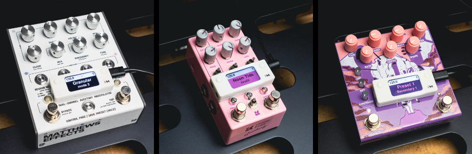
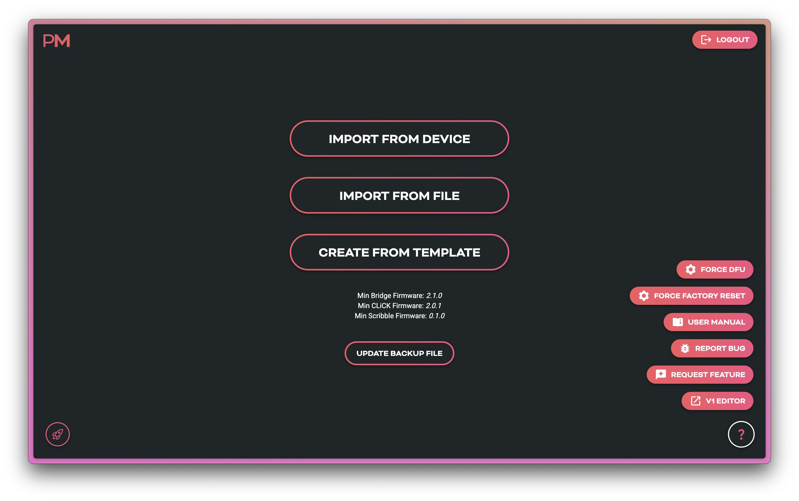
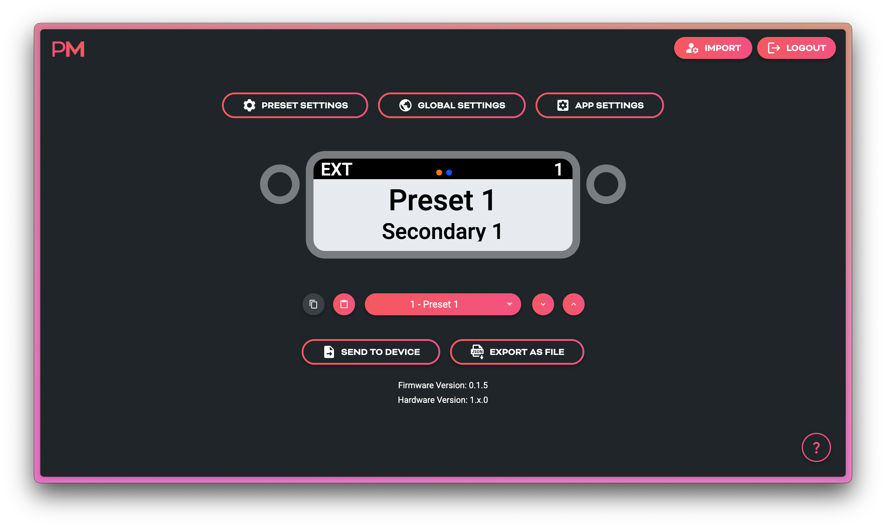
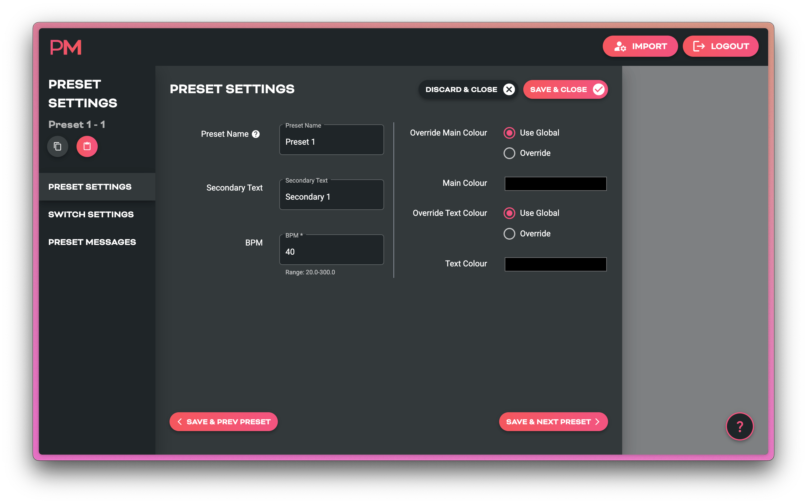
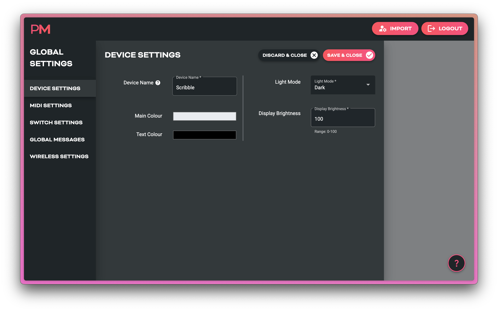

# Scribble Quickstart Guide
_A compact, configurable LCD display for showing custom preset names and other text, sending custom MIDI messages, and scrolling presets in your MIDI rig._

!!! info
    This quickstart is for early reviewers and sample units. A full, detailed documentation site will launch soon.

{.imageheight-300}

---

## What is Scribble?
**Scribble** is a standalone, USB-powered display module which can send and be controlled by MIDI messages. 

It shows **text labels**, **preset numbers**, **MIDI clock data**, and **connection status** received over MIDI or inherent in the device itself. 

- Onboard buttons can be used to send preset change commands, or any other set of custom MIDI messages you wish to send. 

- MIDI clock can be received and passed on thru the Scribble, or Scribble can generate its own MIDI clock to send to your MIDI devices. 

- All configuration happens in the [**Pirate MIDI Web Editor**](https://edit.piratemidi.com) — nothing is configured directly on the hardware.

!!! example "PRE-LAUNCH USERS"
    During beta testing, please use the [**development web editor**](https://pm-edit-dev.web.app).

### Key Features
- USB MIDI + 3.5mm TRS MIDI Type A/B *(Switchable in editor)*
- 1.47" LCD display 
- 128 Customisable presets with text, colours, and MIDI messages
- Real-time MIDI clock display  
- Preset switching via CC or PC 
- USB-powered or 9V DC powered
- Web-based configuration *(Chromium browser required)*
- Firmware updates via browser at [**update.piratemidi.com**](https://update.piratemidi.com)

---

### What’s In The Box
- Scribble unit  
- Protective screen overlay
- 3.5x1.1mm to 5.5x2.1mm DC centre negative right angle adapter cable

---

## Quick Setup (60-Second Version)

### 1. Power the Scribble
Connect to any 5V USB-C or 9V DC power source.  
On first power-up, a welcome process will start and prompt for any new firmware updates. After first power-up, this screen will not show again.

### 2. Open the Web Editor
Go to:  
[**https://edit.piratemidi.com**](https://edit.piratemidi.com)

!!! warning "Browser Support"
    Use Chrome or another Chromium browser. Non-Chromium browsers do not support webMIDI or webSerial and will not recognise your device.

Select **Import from Device**, then choose the device with  
`SCRIBBLE` in the name, and click **connect**

### 3. Edit a Preset
On the main screen, you can start editing your presets by clicking on the text entries and simply replacing it with your own. 
To change what function the buttons perform, click on one of the buttons' representations on the screen.

On the main screen you can:

- View and edit text labels  
- View global or per-preset colour settings visually   
- Scroll through presets
- Copy and Paste whole presets for efficient workflows 
- Use keyboard shortcuts `J` and `K` to change presets

### 4. Upload to Device
Click **Send to Device**. Select the Scribble from the pop-up and press `Connect`
The Scribble updates instantly — no reboot needed.

## Using the Web Editor

### Import Screen Overview
- **Import from Device** — connect your device by USB and import all its configuration
- **Import from File** — use a Pirate MIDI .json config file to load a configuration (backups, alternate configs etc.)  
- **Create from Template** — use pre-made configs including blank, factory default, and brand or device starting templates from Pirate MIDI 

---

### Main Screen Overview
Each preset on the device and the editor primarily contains **these elements**:

| Element | Purpose |
|--------|---------|
| **Primary Text Label** | 12-Character Text Field |
| **Secondary Text Label** | 16-Character Text Field |
| **Preset Number** | Shows Scribble's Current Preset |
| **MIDI Clock** | Shows Incoming or Generated MIDI Clock in BPM, ms, or with Flasher |
| **Status Indicators** | Shows Incoming MIDI and BLE Status |
| **Background Colour** | Configured Globally or Per Preset |
| **Text Colour** | Configured Globally or Per Preset |
| **Status Bar Colour** | Light or Dark Mode Selected Globally |

You can see these elements all displayed on the editor screenshot below

On top of these obvious parameters, there are also MIDI messages, MIDI clock, and other settings that can change how you use your Scribble.

Below the main visualisation of the Scribble, you'll also see a number of buttons near the bottom of the screen. These buttons are for navigating, copying, and pasting full presets. 

### Sending Your Config To The Scribble
**Send to Device** is the button to send the modified config to the Scribble. No changes are synced until you press this button and transfer the settings - even if you first imported from the device and left the device connected with USB. 

### Saving or Backing Up Multiple Configs
Backing up your configuration is an important part of working with technology. You may also use your Scribble in different contexts and need to switch whole configurations at a moment's notice. If this is the case, you can save your configurations to your computer using the **Export as File** button. 

A `.JSON` file will be saved to your computer. These files can be edited without the web editor as well (if you have the inclination!).

### Preset Settings Page
Here you will find a set of submenus which let you set colours, modes, and MIDI messages that will apply **only to the current preset**

| Submenu | What's Inside |
|--------|---------|
| **Preset Settings** | Text Fields, Colours, Tempo |
| **Switch Messages** | Add MIDI Messages To Each Switch |
| **Preset Messages** | Add Other Custom MIDI Messages |

### Global Settings Page
Here you will find a set of submenus which let you configure MIDI channel, MIDI outputs, MIDI Thru routing, custom global messages, and more. MIDI Messages added to a *global* message stack will not be restricted to a single preset, but available at all times in all presets.

| Submenu | What's Inside |
|--------|---------|
| **Device Settings** | USB Display Name, Light/Dark Mode, Display Brightness, Colours |
| **MIDI Settings** | TRS MIDI Type, Clock Mode, Ext CC, MIDI Channel, Thru Routing |
| **Switch Settings** | Switch Modes, Global Switch Messages |
| **Global Messages** | Global Custom Trigger MIDI Messages |
| **Wireless Settings** | Wireless Mode, BLE Mode |

### App Settings Page
Here you will find web-editor specific tools. Currently this includes MIDI Channel Aliases. 
Add the names of your devices to their respective MIDI channel section, and the name of that device will show across the entire web editor anywhere you need to choose a MIDI channel. Then, instead of a list of MIDI channel numbers, you'll see a list of your devices. This makes it a lot easier to quickly choose which device you're sending a MIDI messages to! 

---

## Connecting Scribble to Your Gear

### USB MIDI
Scribble is a USB device (not a host) and when using USB for MIDI communication you can connect directly to:

- Computers
- Tablets
- Phones
- Other USB Host Devices
- MIDI Controllers With Host Ports
- Kemper Profiler Player's USB Host Port 

### TRS MIDI (Type A/B Switchable)
Compatible with:

- Strymon (Type A) 
- Chase Bliss Audio (Type B)
- Boss (Type A)
- Meris (Type A)
- Jackson Audio (Type A)
- And standard TRS MIDI pedals

!!! failure "Older Chase Bliss Audio Pedals"
    Some original Chase Bliss Audio pedals with MIDI require the Tip of the TRS cable to be completely disconnected, and the Scribble cannot do that. You will need to phyiscally modify any TRS cable you're using to disconnect the Tip if you want to use them. You will also need to set the MIDI out to Type B, of course. 

### BLE MIDI
Bluetooth Low Energy (BLE) MIDI can be used with WIDI by CME, M-Vave Chocolate, and other BLE MIDI devices to wirelessly send MIDI to your Scribble to control it. Tablets, phones, and computers can also connect and send MIDI. Apps like TouchOSC, DAWs, OnSong, and other sheet music apps can often send MIDI over BLE. 

---

## Example Use Cases

-   **Bridge6 + Scribble**  
    Show preset name, scene name, and active toggle states.

-   **CLiCK v2**  
    Visualise relay states or amp channel status when the CLiCK v2 is underneath your pedalboard.

-   **Simple USB Setup**  
    Connect straight to a laptop to display DAW parameters.

---

## Firmware Updates

Scribble uses the same updater as BridgeOS devices.

### How to Update
1. Backup your config to your computer using the [**Web Editor**](https://edit.piratemidi.com) 
2. Visit [**https://update.piratemidi.com**](https://update.piratemidi.com)  
3. Connect Scribble via USB-C  
4. Click **Connect Device**  
5. Select **Scribble** in the list  
6. Press **Update Firmware**  
7. Wait for the progress bar to finish  
8. The device auto-reboots